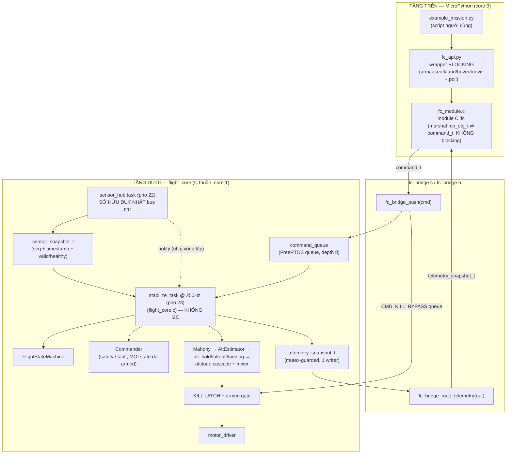
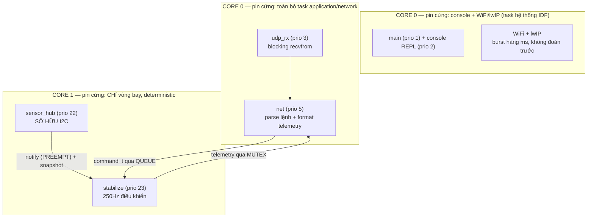
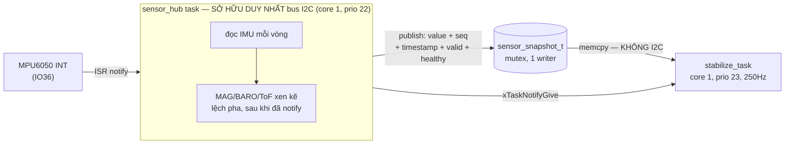
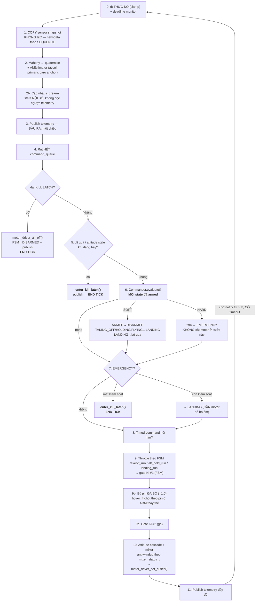
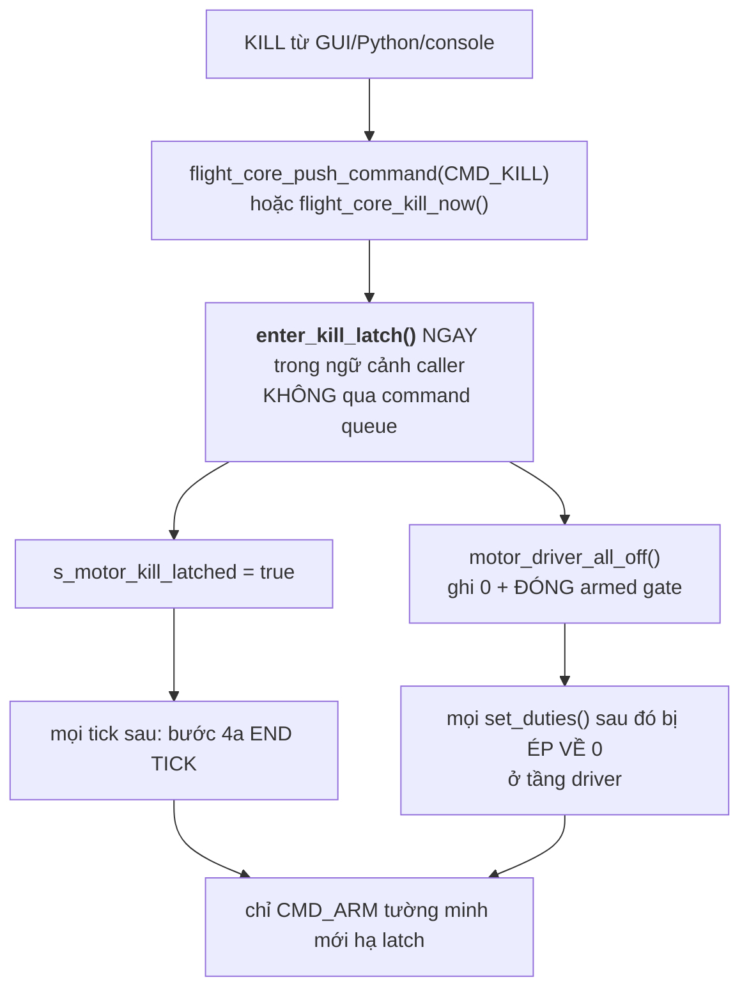
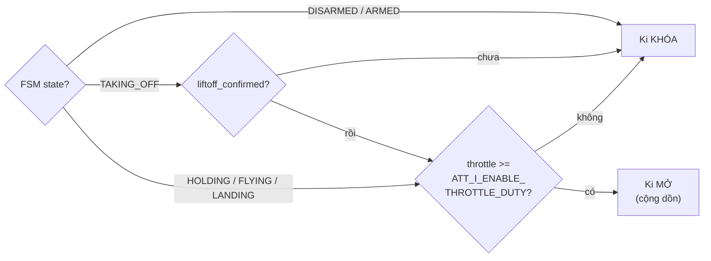
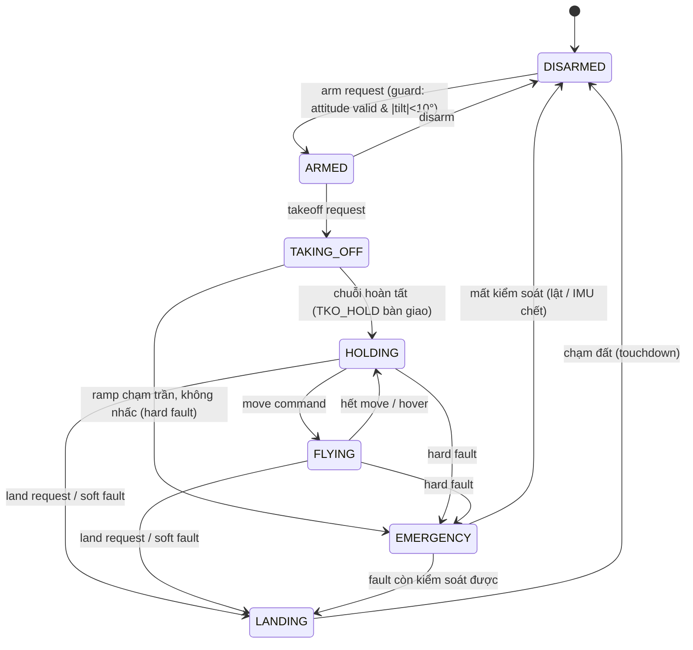
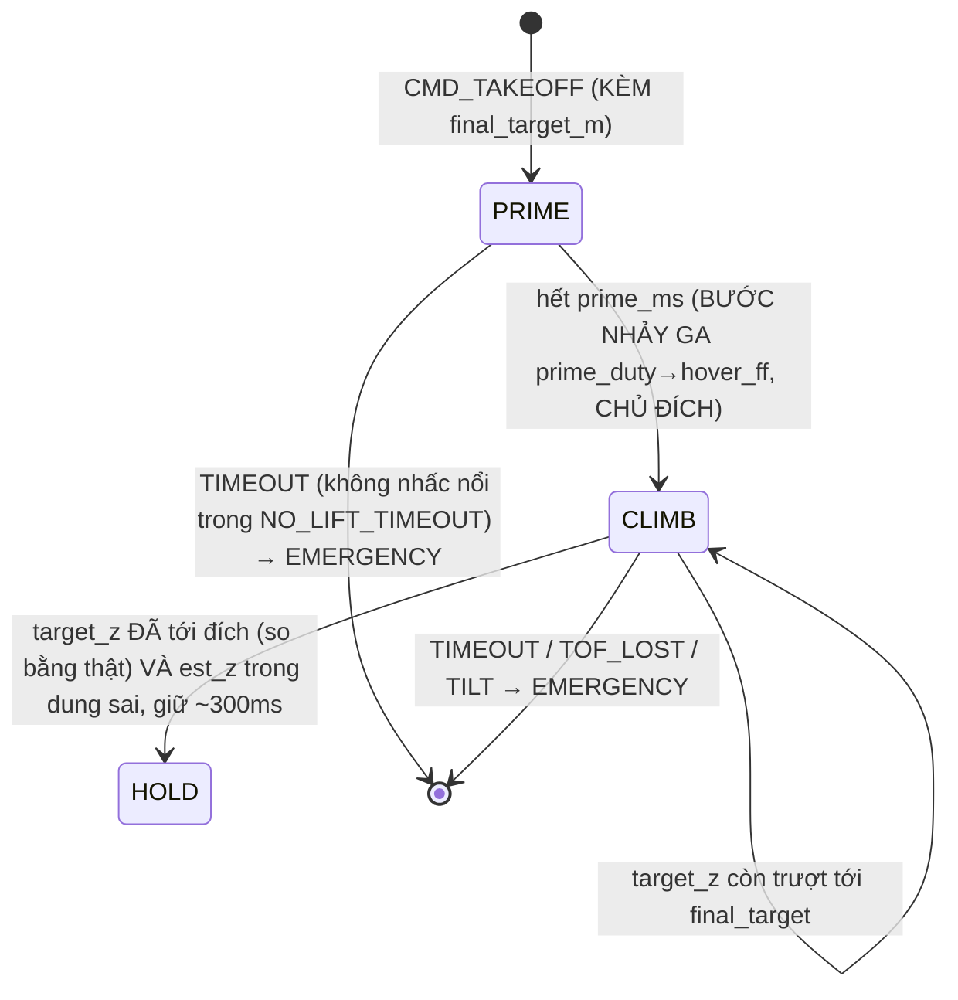
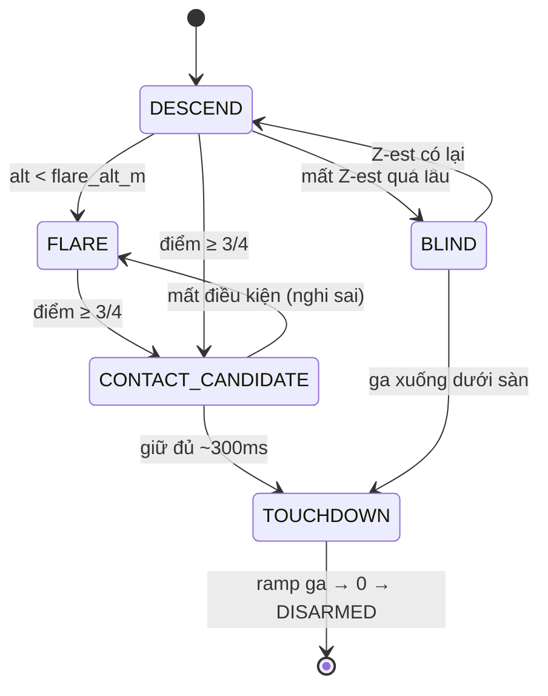

# UAV-S3 — Luồng code end-to-end

Kiến trúc 2 tầng: **MicroPython (core 0)** ra lệnh, **C thuần `flight_core` (core 1)**
điều khiển bay. Hai tầng chỉ giao tiếp qua **2 kênh duy nhất**: `command_t` (xuống)
và `telemetry_snapshot_t` (lên) — không con trỏ chung, không state dùng chung.

## 1. Kiến trúc tổng quan



**Nguyên tắc bất di**: mọi phép toán điều khiển (PID/mixer/state machine/safety)
nằm trong `components/flight_core`. `fc_module.c` và `fc_bridge.c` chỉ **marshal**
dữ liệu — không có `if` liên quan tới logic bay. `fc_api.py` là **nơi duy nhất**
thêm ngữ nghĩa blocking (poll + timeout); `fc.*` (module C) chỉ đẩy lệnh và trả
về ngay.

**Tầng trên còn có một lối vào THỨ HAI, song song với MicroPython**:
`src/main.c` (console USB + UDP qua WiFi) — dùng khi build KHÔNG cần
MicroPython, hoặc để một GUI PC (`tools/uav_udp_console.py`) điều khiển/tune
trực tiếp. Nó gọi ĐÚNG 2 API công khai giống `fc_bridge.c`
(`flight_core_push_command()` / `flight_core_read_telemetry()`) — không có
đường tắt nào khác vào `flight_core`. Chi tiết ở **mục 7**.

**Ba đường đi có chủ đích lệch khỏi sơ đồ chuẩn:**

- `sensor_hub` là task **thứ hai** trong tầng dưới, và nó **đánh thức**
  stabilize_task — nghĩa là nhịp vòng điều khiển đến từ cảm biến, không từ đồng
  hồ. Có timeout dự phòng nên hub treo không làm vòng điều khiển đứng (mục 3.4).
- `CMD_KILL` **không đi qua command_queue**: queue depth 8 có thể đầy, mà lệnh
  dừng máy không được phép rơi vì "hàng đợi bận" (mục 3.7.3).
- Telemetry đi **một chiều ra ngoài**. Logic bay (arm guard, Commander) đọc
  state nội bộ `s_prearm`/snapshot, **không đọc ngược** `telemetry_snapshot_t`.

## 2. Luồng một lệnh Python (ví dụ `fc.takeoff(800)`)

```mermaid
sequenceDiagram
    participant Script as example_mission.py
    participant Api as fc_api.py
    participant Mod as fc_module.c (fc.takeoff)
    participant Bridge as fc_bridge.c
    participant Queue as command_queue
    participant Task as stabilize_task (250Hz)

    Script->>Api: fc.arm(); fc.takeoff(800)
    Api->>Mod: fc.takeoff(800)  [gọi thô]
    Mod->>Mod: cmd = {type: CMD_TAKEOFF, alt_mm: 800}
    Mod->>Bridge: fc_bridge_push(&cmd)
    Bridge->>Queue: xQueueSend (non-blocking)
    alt queue đầy
        Bridge-->>Mod: false
        Mod-->>Api: raise RuntimeError
    end
    Mod-->>Api: trả về NGAY (không đợi bay)

    loop mỗi tick 250Hz
        Task->>Queue: xQueueReceive (rút hết)
        Task->>Task: apply_command(CMD_TAKEOFF)<br/>target_alt_m = 0.8 (geofence clamp)<br/>fsm: ARMED → TAKING_OFF
    end

    Note over Task: TOÀN BỘ chuỗi chạy TRONG firmware:<br/>PRIME (ga sàn) → CLIMB (target_z trượt tới 0.8m)<br/>→ HOLD (đúng 1 vòng, bàn giao)<br/>→ fsm: TAKING_OFF → HOLDING
    Api->>Api: poll fc.get_state() mỗi 0.1s<br/>tới khi "HOLDING" (hoặc timeout → land())
    Note over Api: HẾT. KHÔNG gửi lệnh thứ hai.
```

Điểm mấu chốt: **`fc.takeoff(800)` là lệnh DUY NHẤT cần gửi.** Target độ cao
nằm ngay trong `command_t`, và firmware tự chạy hết chuỗi tới khi vào `HOLDING`
ở đúng 800mm. `fc_api.takeoff()` giờ **chỉ poll trạng thái**.

> **Đã đổi so với bản trước.** Bản cũ bỏ qua `alt_mm`: firmware chỉ spool + nhấc
> lên rồi chốt target = độ cao lúc đó (~20cm), và `fc_api.takeoff()` phải gửi
> **thêm `set_altitude(800)`** sau khi thấy `HOLDING` mới leo tới nơi. Script
> crash/mất kết nối giữa hai lệnh thì drone treo lơ lửng sát đất — không ai
> hoàn tất, cũng không ai huỷ. Đó là semantics bay bị rò lên tầng Python; giờ
> firmware tự chịu trách nhiệm **hoàn thành HOẶC tự abort an toàn**, kể cả khi
> MicroPython biến mất. Chi tiết chuỗi + liftoff detector: mục 4.2.

## 3. Phân chia task RTOS

FreeRTOS tick rate = **1000Hz** (`CONFIG_FREERTOS_HZ=1000`), dual-core
(`CONFIG_FREERTOS_UNICORE` **tắt**). Firmware tạo **4 task** của riêng nó; phần
còn lại là task hệ thống của ESP-IDF (WiFi, lwIP, timer, idle).

### 3.1 Bảng task — nguồn sự thật

Tên trong cột đầu là **tên FreeRTOS thật** (thấy được qua `vTaskList`/panic dump),
không phải tên hàm C.

| Task | Core | Prio | Stack | Nhịp / nguồn nhịp | Tạo ở | Vai trò |
|---|---|---|---|---|---|---|
| `stabilize` <br>(hàm `stabilize_task`) | **1** | **23** | 4096 B | `xTaskNotifyGive` từ hub, dự phòng `vTaskDelayUntil` 250Hz | [flight_core.c](components/flight_core/src/flight_core.c) `flight_core_start()` | **TOÀN BỘ điều khiển bay**: Mahony, estimator, FSM, Commander, takeoff/hold/land, mixer, motor |
| `sensor_hub` | **1** | **22** | 4096 B | ngắt MPU6050 IO36, dự phòng `vTaskDelayUntil` 250Hz | [sensor_hub.c](components/flight_core/src/sensor_hub.c) `sensor_hub_start()` | **SỞ HỮU DUY NHẤT bus I2C**. Đọc IMU/MAG/BARO/ToF/battery, publish snapshot |
| `net` | **0** | 5 | 4096 B | `vTaskDelay` 5ms | [main.c](src/main.c) `app_main()` | Ground-station UDP: parse text → `command_t`, format telemetry |
| `udp_rx` | **0** | 3 | 4096 B | blocking `recvfrom()` | [net_link.c](src/net_link.c) `net_link_init()` | Chỉ nhận UDP, không parse |
| `console` (REPL, IDF) | **0** | 2 | 4096 B | console USB blocking | `esp_console_start_repl()` | Lệnh console USB |
| `main` (IDF) | 0 | 1 | 3584 B | kết thúc sau khi init xong | ESP-IDF | Khởi tạo, đăng ký lệnh |

**Stack tính bằng BYTE ở mọi dòng trong bảng.** `xTaskCreate()`/
`xTaskCreatePinnedToCore()` của **ESP-IDF nhận stack theo BYTE**, không theo
word — IDF cố ý đổi khác FreeRTOS vanilla (nơi tham số là `usStackDepth` tính
theo word). `4096` trong `xTaskCreatePinnedToCore(..., 4096, ...)` là **4KB**.

> **Sai đã sửa trong tài liệu này.** Bản trước ghi "4096 w = 16KB" cho cả hai
> task bay — sai đúng **4 lần**. Con số đó không vô hại: nó là thứ người ta dùng
> để quyết định "còn dư stack, thêm buffer cục bộ thoải mái", và
> `sensor_snapshot_t` + các struct tick nằm trên stack của chính hai task đó.

Hai task bay **pin cứng vào core 1**; **mọi task còn lại của firmware pin cứng
vào core 0**.

⚠ **Core 1 CHỈ có vòng bay.** `net`/`udp_rx` trước đây dùng `xTaskCreate()` trần,
mà trên build dual-core hàm đó tương đương
`xTaskCreatePinnedToCore(..., tskNO_AFFINITY)` → scheduler **được phép** đặt
chúng lên core 1. Priority thấp chỉ đảm bảo chúng không **preempt** vòng bay; nó
không ngăn chúng chạy trong khe rảnh của core 1, làm bẩn cache và thêm jitter
vào `dt`. Giờ cả hai (và cả REPL console, qua `repl_config.task_core_id`) đều pin
core 0 tường minh.

`CONFIG_ESP_MAIN_TASK_AFFINITY_CPU0=y` chỉ pin **task `main`**, KHÔNG lan sang
các task mà nó tạo ra — đây là chỗ dễ hiểu nhầm, và là lý do phải pin từng task.

**Task hệ thống cũng phải kiểm tra, không chỉ task của mình.** `sdkconfig` của
project đặt lwIP TCP/IP (prio 18) sang `CONFIG_LWIP_TCPIP_TASK_AFFINITY_CPU0=y`;
mặc định của nó là `NO_AFFINITY`, tức một burst mạng được phép chạy trên core 1.
WiFi đã pin CPU0 sẵn (`CONFIG_ESP_WIFI_TASK_PINNED_TO_CORE_0=y`), `esp_timer`
cũng vậy (`CONFIG_ESP_TIMER_TASK_AFFINITY_CPU0=y`).

**MicroPython VM**: port MicroPython không được build trong repo này
(`micropython_module/fc/` chỉ là module C bind vào `flight_core`, không tạo task
nào). Khi build port thật, VM task PHẢI pin core 0 theo đúng nguyên tắc trên.

#### Bức tranh priority ĐẦY ĐỦ (gồm task hệ thống IDF)

`configMAX_PRIORITIES = 25` → dải hợp lệ **0..24**. Tra từ `FreeRTOSConfig.h` +
`esp_task.h` của ESP-IDF, không phải phỏng đoán:

| Prio | Task | Core | Ghi chú |
|---|---|---|---|
| **24** | `ipc0` / `ipc1` | mỗi core 1 con | `IPC_MAX_PRIORITY`. **`ipc1` NẰM TRÊN CORE 1** |
| **23** | **`stabilize`** | **1** | ← cao nhất mà firmware được dùng |
| **22** | **`sensor_hub`** | **1** | ngay dưới vòng bay |
| 22 | `esp_timer` | 0 | `ESP_TASK_TIMER_PRIO`, pin CPU0 nên không tranh với core 1 |
| 20 | esp event task | — | |
| 18 | lwIP TCP/IP | 0 | `CONFIG_LWIP_TCPIP_TASK_PRIO`, pin CPU0 (xem 3.1) |
| 5 | `net` | 0 | |
| 3 | `udp_rx` | 0 | |
| 2 | console REPL | 0 | |
| 1 | `main` | 0 | |

**Vì sao `stabilize` là 23 chứ không phải 24** (= mức cao nhất tuyệt đối): 24
sẽ **ngang với `ipc1`**, task IPC của chính core 1. Cùng priority = round-robin,
và `esp_ipc_call*` là đường **đồng bộ** giữa 2 core mà IDF dùng nội bộ (ví dụ cấp
phát ngắt cho core kia) — bên gọi BLOCK tới khi ipc task chạy xong. Ở 23 vòng bay
đã preempt được **mọi** task khác trên core 1, nên 24 không cho thêm gì mà chỉ
thêm một đường tương tác khó suy luận vào lõi an toàn.

`sensor_hub` ở 22 **ngang `esp_timer`** — không sao, vì `esp_timer` pin CPU0
(`CONFIG_ESP_TIMER_TASK_AFFINITY_CPU0=y`) còn hub pin CPU1. Hai task cùng
priority chỉ round-robin với nhau khi ở **cùng một core**.

Ba bất biến này được canh **lúc biên dịch**, không phải bằng comment:

```c
_Static_assert(STABILIZE_TASK_PRIORITY > SENSOR_HUB_TASK_PRIORITY, ...);   // flight_core.c
_Static_assert(STABILIZE_TASK_PRIORITY < configMAX_PRIORITIES - 1, ...);   // flight_core.c
_Static_assert(SENSOR_TASK_PRIORITY < configMAX_PRIORITIES - 1, ...);      // sensor_hub.c
```

Priority của hub nằm ở `sensor_hub.h` (không phải `.c`) chính là để
`flight_core.c` assert được — hai số ở hai file mà không có gì bắt chúng khớp là
đúng loại lỗi chỉ lộ ra khi đang bay.

Không task nào bị bỏ đói: **cả hai** task core 1 luôn BLOCK trong
`ulTaskNotifyTake()`/`vTaskDelayUntil()` giữa các vòng, nên idle task của core 1
vẫn được chạy — điều kiện để Task Watchdog
(`CONFIG_ESP_TASK_WDT_CHECK_IDLE_TASK_CPU1=y`, timeout 5s) không panic.

### 3.2b Tốc độ I2C — một nguồn sự thật

Tất cả 4 chip chạy **400kHz (Fast Mode)**, đặt ở **một chỗ duy nhất**:
`BOARD_I2C_FREQ_HZ` trong [board_config.h](main/board_config.h).

```
BOARD_I2C_FREQ_HZ ──> cfg.i2c_freq_hz ──> flight_core_start() validate 10k..1M
                                            │
                                            ├─> imu_driver_init(bus, addr, hz)
                                            ├─> mag_driver_init(bus, addr, hz)  ─┐
                                            ├─> baro_driver_init(bus, addr, hz)  │ ghi lại vào
                                            └─> tof_driver_init(..., hz)       ──┘ static để
                                                                                  add lại device
                                                                                  cùng tốc độ
```

⚠ **Tần số I2C là thuộc tính của DEVICE, không phải của BUS.** Trong API I2C
master mới của ESP-IDF, `i2c_master_bus_config_t` **không có field tần số nào** —
nó nằm ở `i2c_device_config_t.scl_speed_hz`, đặt riêng cho từng
`i2c_master_bus_add_device()`. Đó là lý do nó phải được truyền xuống từng driver.

> **Bẫy đã sửa.** Trước bản này `cfg.i2c_freq_hz` là **field chết**: `main.c` +
> `fc_bridge.c` gán nó nhưng `flight_core` **không đọc**, còn tốc độ thật đến từ
> 4 hằng số `400000` mà mỗi driver tự `#define` riêng. Sửa `BOARD_I2C_FREQ_HZ`
> khi đó **không có tác dụng gì** — một config trông có thẩm quyền nhưng không
> điều khiển gì cả. 4 bản sao đã bị xoá; nếu `i2c_freq_hz` ngoài dải hợp lệ,
> `flight_core_start()` log lỗi rõ rồi rơi về 400000 thay vì để `add_device()`
> thất bại im lặng ở 0 Hz.

Log lúc boot xác nhận được tốc độ thật đang chạy:

```
flight_core: I2C bus SDA=44 SCL=43, tat ca device o 400000 Hz (Fast Mode)
imu_driver:  MPU6050 @0x68, SCL 400000 Hz
mag_driver:  QMC5883P @0x2C, SCL 400000 Hz
baro_driver: BMP280 @0x77, SCL 400000 Hz
```

### 3.2 Vì sao chia như vậy



**Ba quy tắc, mỗi cái sinh ra từ một kiểu hỏng cụ thể:**

1. **Core 1 không có WiFi/lwIP, và không có gì thuộc tầng application.** Chúng
   có burst hàng ms không đoán trước. Nếu vòng 250Hz (ngân sách 4ms/tick) chia
   CPU với chúng thì jitter dt đi thẳng vào PID và estimator. WiFi/lwIP/console/
   `net`/`udp_rx` đều pin core 0; vòng bay pin core 1.

2. **`stabilize` prio 23 > `sensor_hub` 22 — và thứ tự này quan trọng.**
   Mọi `i2c_master_transmit*` lúc init có timeout **50ms** (runtime đã siết
   xuống **8ms**, xem 3.5b). Cảm biến treo/SDA bị kéo thấp mà đọc I2C nằm trong
   vòng bay thì `stabilize_task` **đứng trong lúc motor giữ nguyên duty cuối** —
   không crash, không báo lỗi, chỉ mất điều khiển. Tách ra thì hub bị **BLOCKED**
   (chứ không spin), `stabilize_task` vẫn quay bằng đồng hồ dự phòng và **thấy
   dữ liệu cũ qua timestamp** → Commander trip hard fault.

   Lập luận đó **không** phụ thuộc vào việc hub ưu tiên cao hơn — nó chỉ cần hub
   BLOCKED. Đặt hub cao hơn (bản cũ: hub 23, stabilize 20) lại gây hại: sau
   `xTaskNotifyGive()` hub **vẫn giữ CPU** và chạy tiếp MAG/BARO/ToF, nên vòng
   bay phải xếp hàng sau 1–3 transaction I2C dù đã có đủ mẫu IMU. Với thứ tự
   đúng, `xTaskNotifyGive()` **preempt hub ngay tại dòng đó**: một tick điều
   khiển chạy trọn rồi block lại, hub mới đọc nốt cảm biến chậm.

3. **Chỉ `sensor_hub` gọi `*_driver_read()`.** Không chỉ vì kiến trúc đẹp:
   QMC5883P **xoá cờ DRDY ngay khi đọc STATUS**, hai nơi cùng đọc sẽ ăn trộm mẫu
   của nhau và cả hai đều thấy "lúc có lúc không". Mahony, calibration, telemetry
   **đều** đọc snapshot.

### 3.3 Ba kênh giao tiếp giữa task — và chiều dữ liệu

```
sensor_hub ──> stabilize_task : sensor_snapshot_t   (MUTEX, 1 writer)  + xTaskNotifyGive
net/console/µPy ──> stabilize_task : command_t      (QUEUE, nhiều writer)
stabilize_task ──> net/console  : telemetry_snapshot_t (MUTEX, 1 writer)
```

**Telemetry đi MỘT CHIỀU ra ngoài.** `stabilize_task` **không bao giờ** đọc ngược
`s_telemetry` làm đầu vào logic bay — state nội bộ là `s_prearm`/`s_tko_state`/
`s_alt_est`. Đọc ngược telemetry nghĩa là đổi format/lọc telemetry sẽ vô tình đổi
hành vi bay.

**Mọi nguồn lệnh dùng CHUNG một queue** — console USB, UDP ground-station,
MicroPython `fc.*` đều chỉ `flight_core_push_command()`. Không nguồn nào chạm
motor/PID trực tiếp, nên không có đường nào bỏ qua FSM + Commander.

> **KILL là ngoại lệ duy nhất có chủ đích**: `CMD_KILL` bypass thứ tự queue và
> `motor_driver_all_off()` cắt ở tầng driver. Xem mục 3.6.

### 3.4 Nhịp: một đồng hồ vật lý, hai tầng dự phòng

Nguồn nhịp gốc là **chân INT data-ready của MPU6050 (IO36)** — không phải đồng hồ
FreeRTOS. Lý do: sample rate của MPU6050 được cấu hình **bằng đúng**
`CONTROL_TASK_HZ=250` (có `_Static_assert`), nên chạy theo INT thì mỗi tick điều
khiển ứng với **đúng một mẫu IMU mới**, không bao giờ đọc lại mẫu cũ hoặc nhảy mẫu.

```
MPU6050 INT (IO36) ──ISR──> sensor_hub thức (prio 22)
                             │ đọc IMU
                             │ publish snapshot IMU (seq++, timestamp)
                             ├──> xTaskNotifyGive ──┐
                             │                      │ stabilize prio 23 > 22
                             │                      ▼ PREEMPT NGAY tại dòng này
                             │            stabilize_task chạy TRỌN một tick:
                             │              Mahony → Az/Vz/Z → safety/FSM
                             │              → PID → mixer → ghi motor
                             │              → block lại trong ulTaskNotifyTake()
                             │                      │
                             ▼◄─────────────────────┘ hub được chạy tiếp
                            MAG/BARO/ToF/battery xen kẽ
```

Hai điều làm nên thứ tự này, **cả hai đều cần**:

1. `xTaskNotifyGive` gọi **trước** khi hub đọc mag/baro — vòng điều khiển chỉ cần
   IMU để chạy, không nên đợi thêm 2–3 transaction I2C nữa.
2. `stabilize` **ưu tiên cao hơn** hub và **cùng core** — nếu không, (1) chỉ là
   "đặt cờ": hub vẫn giữ CPU chạy nốt mag/baro/ToF rồi mới tới lượt vòng bay.
   Preemption chỉ xảy ra trong cùng một core, nên `_Static_assert` canh cả hai
   điều kiện.

| Tầng | Điều kiện rơi xuống | Hệ quả |
|---|---|---|
| INT MPU6050 | — | nhịp khớp mẫu IMU 1:1 |
| `vTaskDelayUntil` trong hub | INT trượt **25 lần liên tiếp** (`IMU_INT_MISS_STREAK_MAX`, ~100ms) | hub vẫn đọc + publish đúng 250Hz |
| `vTaskDelayUntil` trong stabilize | hub ngừng notify 25 lần liên tiếp | vòng bay **vẫn quay đúng 250Hz** nhưng dữ liệu stale → Commander thấy qua `imu_age_ms` |

**Quy tắc an toàn không được phá: KHÔNG task nào chờ vô hạn.** Timeout chờ INT =
2 chu kỳ (`ulTaskNotifyTake` có timeout, sàn 1 tick — timeout 0 sẽ biến nó thành
busy-loop 100% CPU). Vòng bay đứng im nghĩa là motor giữ duty cuối **và**
Commander/failsafe/watchdog cũng ngừng chạy — kiểu hỏng tệ nhất có thể.

`ulTaskNotifyTake(pdTRUE, ...)` **xoá** bộ đếm khi lấy: task bị trễ mà
notification dồn lại thì bỏ phần dồn, xử lý mẫu **mới nhất**, **không chạy bù**.
Với vòng điều khiển đó là đúng — dữ liệu cũ không còn giá trị.

Hub gọi `xTaskNotifyGive` **không điều kiện** mỗi vòng, kể cả khi đọc IMU lỗi:
nó là đồng hồ nhịp của vòng bay, và vòng bay **phải** chạy để safety/failsafe/
Commander chạy. Mẫu lỗi không tăng `seq` (`mark_err`), nên vòng bay tự phân biệt
được — xem 3.4b.

#### 3.4b Tick KHÔNG có mẫu IMU mới — cái gì chạy, cái gì không

`stabilize_task` chạy 250Hz **bằng đồng hồ riêng** của nó khi cần, nên có những
tick nó thức dậy mà snapshot **không có mẫu IMU mới**: hub bị chặn ở I2C, INT
đứt và hub rơi về polling lệch pha, hoặc lần đọc IMU vừa rồi lỗi.

`imu_updated = (imu_h.seq đổi) && (tuổi mẫu ≤ SENSOR_IMU_STALE_US)` là cờ quyết
định. Nó **không** thay được bằng `imu.ok` hay `imu_fresh`:

- `imu.ok = false` **không chặn được gì** — `mahony_update()` không nhận cờ `ok`,
  nó nhận thẳng `gyro`/`accel`, và giá trị cũ vẫn nằm nguyên trong snapshot.
- `imu_fresh` một mình cho phép **5 tick liên tiếp** tích phân lại cùng một mẫu
  (20ms / 4ms), vì mẫu cuối vẫn "chưa quá hạn" trong suốt cửa sổ đó.

| Bước trong tick | Có mẫu mới | KHÔNG có mẫu mới |
|---|---|---|
| deadline monitor, kill latch, SP watchdog | chạy | **chạy** |
| tilt / attitude-stale failsafe, Commander, FSM | chạy | **chạy** (Commander thấy `imu_stale`) |
| mixer + ghi motor | chạy | **chạy** (P/D trên trạng thái hiện có) |
| `mahony_update()` | chạy | **BỎ QUA** |
| `alt_estimator_update()` (Az/Vz/Z) | chạy | **BỎ QUA** |
| I-term của attitude cascade | chạy | **FREEZE** (không reset) |
| tích lũy calib gyro/accel | chạy | **BỎ QUA** |

`dt` dùng cho tích phân là **`fusion_dt`** — thời gian giữa hai **mẫu** (cộng dồn
qua các tick bị bỏ), không phải giữa hai **tick**. Mất 3 mẫu rồi có lại mà vẫn
dùng dt của 1 tick thì góc/vận tốc bị tính **hụt** đúng bằng phần đã mất. Clamp
cùng dải `[CONTROL_DT_MIN_S, CONTROL_DT_MAX_S]`.

Vì sao P/D vẫn chạy mà I thì không: P/D là **hàm thuần** của trạng thái hiện tại
— chạy lại trên cùng số liệu cho ra cùng một lệnh, vô hại, và giữ được mô-men ổn
định trong lúc chờ. I **cộng dồn**, nên mỗi tick lặp lại là một lần nạp thêm cùng
một sai số; mất 5 tick = I bị nạp gấp 5 lần thực tế rồi bung ra thành cú giật
mô-men đúng lúc mẫu quay lại.

Cửa sổ này ngắn theo thiết kế: quá `SENSOR_IMU_STALE_US` (20ms) thì Commander
trip **HARD fault** `"imu stale"` → EMERGENCY. Bộ đếm `imu_no_new_sample_count`
(telemetry, xem `loop_clock`) phải **đứng yên** ở nhịp bình thường.

### 3.5 Nhịp con của sensor_hub — vì sao xen kẽ, không gộp

Hub chạy 250Hz nhưng **không đọc cả 4 cảm biến mỗi vòng**: gộp lại thì thời gian
chiếm bus của một vòng bị **dồn cục**, làm mẫu IMU của vòng sau bị trễ.

| Cảm biến | Divisor | Tần số thật | Lý do |
|---|---|---|---|
| IMU (MPU6050) | 1 | 250Hz | nguồn nhịp, vòng bay cần mỗi tick |
| MAG (QMC5883P) | 5 | ~50Hz | ODR chip thấp hơn nhiều, đọc dày hơn vô ích |
| BARO (BMP280) | 5, **lệch pha 2** | ~50Hz | khớp P×8 + IIR×8. Lệch pha để **không rơi cùng vòng với mag** |
| Battery (ADC) | 25 | ~10Hz | không qua I2C. 10Hz vì sụt áp dưới tải xảy ra trong ~100ms — lấy mẫu 200ms/lần có thể bỏ lỡ hẳn đáy sụt mà failsafe pin cần thấy |
| ToF (VL53L0X) | 8, **lệch pha 4** | ~31Hz | timing budget 33ms → chip chỉ đổi mẫu ~30Hz; đọc dày hơn chỉ lấy lại **cùng một** measurement. Lệch pha 4 để không rơi cùng vòng với mag(0) hay baro(2) |

Vì hub có nhịp riêng cho từng cảm biến, **nhiều tick 250Hz liên tiếp thấy cùng
một mẫu baro**. Nên "mẫu mới" xác định bằng **`seq`**, không bằng cờ `ok` — đảm
bảo mỗi mẫu baro được tiêu thụ **đúng một lần** (xem `alt_estimator.h` "CORRECT";
correction chạy 5× dự kiến sẽ kéo Z về baro mạnh gấp 5 lần và nhìn ra ngoài
giống hệt "Z không chịu tăng").

### 3.5b Timeout I2C — HAI giá trị, hai mục đích

| Giai đoạn | Timeout | Vì sao |
|---|---|---|
| **INIT** (`*_driver_init()`, probe địa chỉ, đọc blob calib) | **50ms** | chạy MỘT LẦN lúc boot, không ai đang chờ. Rộng rãi để chip chậm khởi động (reset 100ms, PLL settle) không bị kết luận nhầm là "không có" |
| **RUNTIME** (`*_driver_read()` trong `sensor_hub`) | **8ms** | chạy 250 lần/giây; mỗi ms chờ ở đây là một ms vòng bay không có mẫu mới |

Một transaction 14 byte ở 400kHz mất **~0.4ms** — 8ms đã là 20 lần dư. Giữ 50ms
ở runtime nghĩa là một lần bus glitch làm hub đứng **12 chu kỳ điều khiển liên
tiếp**; với 8ms là 2 chu kỳ, và hub kịp `mark_err` để tầng bay thấy stale **đúng
lúc nó xảy ra** thay vì 50ms sau.

Đây **không phải retry**: quá hạn → trả lỗi → hub `mark_err` → vòng sau đọc lại.
Bus chết thật thì `consecutive_errors` vượt ngưỡng và `healthy=false`, đúng đường
đã có sẵn. Cơ chế: mỗi driver giữ một `s_io_timeout_ms`, khởi tạo ở mức INIT và
hạ xuống RUNTIME ở **cuối** `*_driver_init()` (ToF giữ 50ms riêng cho
`i2c_master_probe()` / đổi địa chỉ — hai việc chỉ chạy lúc init).

### 3.6 Bus lease — lệnh bench cần độc chiếm I2C

`mag_selftest` và `calib_baro_ground` (chạy lúc **ARM**) nói chuyện trực tiếp với
chip nên phải mượn bus:

```
stabilize_task: sensor_hub_suspend(timeout)
                  │  hub thấy cờ -> s_suspend_acked = true -> ngủ, KHÔNG chạm HW
                  ▼
                baro_driver_calibrate_ground()   (block ~1s)
                  │
                sensor_hub_resume()  -> hub reset last_wake, KHÔNG quay bù
```

**Không mượn được thì HUỶ lệnh, không chạy đè** — hai bên cùng ghi/đọc chip sẽ
cho ra mốc áp suất nền sai mà vẫn "thành công". Trong lúc suspend, snapshot giữ
nguyên mẫu cuối nhưng **timestamp không được làm mới**, nên consumer tự thấy
stale — đúng như thực tế.

Block ~1s ở đây an toàn vì cả hai lệnh chỉ chạy khi **DISARMED/lúc ARM** (motor
chưa quay). Đây chính là lý do calib baro **không** được đặt sau khi đã vào
`TKO_PRIME`/`TKO_CLIMB`: lúc đó motor đã quay thật, không được phép treo.

---

### 3.6b Chẩn đoán phần cứng — ba lệnh, ba tầng

Ba lệnh console dưới đây trả lời ba câu hỏi **khác nhau**, và phải chạy **theo
thứ tự này** khi một cảm biến không lên. Chạy sai thứ tự thì lệnh sau cho kết
luận vô nghĩa.

| Lệnh | Câu hỏi nó trả lời | Chạy khi |
|---|---|---|
| `i2c_scan` | Trên bus **thật sự** có gì? | Bất kỳ driver nào báo `init that bai` |
| `imu_int_test [sec]` | Xung ngắt data-ready có **đều đúng 250Hz** không? | Nghi vòng bay chạy sai nhịp, `loop_clock` có `timeout>0` |
| `tof_test [sec]` | ToF có **cấp mẫu đều + ổn định** không? | `i2c_scan` đã thấy ToF nhưng `driver_ok=0`, hoặc alt trôi |

**Vì sao `i2c_scan` phải đi trước.** Khi driver báo lỗi có đúng **ba** khả năng —
chip không có điện, chip nối sai chân, chip ở địa chỉ khác dự kiến — và trong log
driver **cả ba hiện ra y hệt nhau**. Quét bus tách chúng ra ngay. Lệnh mượn bus
khỏi `sensor_hub` (`sensor_hub_suspend`) trước khi quét; **không mượn được thì
báo lỗi chứ không quét đè**, vì quét đè sinh NACK giả mà người đọc lại tin là
"chip không có" — tệ hơn hẳn việc không có kết quả nào.

**Vì sao không tin cờ `imu_int_active` một mình.** Cờ đó chỉ nói "đã ghi register
`INT_ENABLE` + cài ISR thành công". Nó **vẫn bằng 1 khi dây INT đứt**, cho tới
khi đủ 25 lần chờ quá hạn liên tiếp. Câu hỏi thật là *nhịp*, và nhịp chỉ đo được
bằng hai mốc `imu_int_isr_count` cách nhau một khoảng thời gian. `imu_int_test`
bắt được hai kiểu hỏng mà cờ không bắt được:

- **~1000Hz** thay vì 250Hz → `SMPLRT_DIV` không được ghi vào chip (chip vẫn chạy
  ODR gốc). PID sẽ chạy với `dt` sai gấp 4.
- **Số lung tung** → chân INT thả nổi sinh cạnh ngẫu nhiên → **ngắt giả**. Nhìn
  log thì "có interrupt", nhưng vòng bay chạy sai nhịp.

**Vì sao `tof_test` đọc từ snapshot chứ không đọc I2C thẳng.** Nó test **đúng con
đường mà vòng điều khiển dùng** (driver → hub → snapshot). Chính chỗ này từng
hỏng: driver init OK nhưng hub không hề đọc ToF — đọc I2C trực tiếp sẽ báo "OK"
trong khi bay vẫn không có dữ liệu.

### 3.7 Vòng lặp `stabilize_task` (250Hz, core 1, `flight_core.c`)

Mục 3.7.1 nhắc lại chiều dữ liệu hub → vòng bay, 3.7.2 mô tả một tick, 3.7.3 mô
tả đường KILL.

#### 3.7.1 Hai task, một chiều dữ liệu

Lý do tách + bảng priority/core: mục **3.1–3.2**. Nhịp con từng cảm biến: **3.5**.
Bus lease: **3.6**. Đây chỉ là hình thu gọn của đường dữ liệu:



Điểm cần nhớ khi đọc mục 3.7.2: bước 1 của tick là **`memcpy` snapshot**, không
phải đọc I2C — và "mẫu mới" xác định bằng **`seq`**, không bằng cờ `ok`.

#### 3.7.2 Một tick của stabilize_task



**Ba khác biệt đáng chú ý nhất so với bản cũ:**

1. **Bước 4a/5/7 có `END TICK` thật.** Bản cũ phát hiện hard fault → gọi
   `motor_driver_stop_all()` → **code chạy tiếp** → bước 10 tính duty mới và
   **bật lại motor trong CÙNG tick**. Giờ latch kết thúc tick ngay, và
   `motor_driver_set_duties()` bị ép về 0 ngay trong driver (armed gate) nên kể
   cả có đường code nào lọt qua cũng không quay được.
2. **`dt` là số ĐO ĐƯỢC**, không phải hằng số `1/250`. Vòng chạy lệch nhịp mà
   dùng hằng số thì mọi hệ số PID/estimator sai theo tỷ lệ lệch — âm thầm,
   không có gì báo lỗi.
3. **Bước 2b/3 tách đầu vào khỏi đầu ra.** Trước đây arm-guard đọc ngược
   `s_telemetry`; sửa format telemetry cho đẹp đồ thị là vô tình đổi logic bay.

#### 3.7.3 Kill path — quyền ưu tiên cao nhất



Hai lớp độc lập: **latch** chặn ở tầng logic (thoát tick sớm), **armed gate**
chặn ở tầng driver (ép duty 0). KILL **không đi qua command queue** vì queue
depth 8 có thể đầy — lệnh dừng máy không được phép rơi vì "hàng đợi bận".

Latch bật khi: `CMD_KILL`, `CMD_DISARM`, tilt vượt `MAX_SAFE_TILT_DEG` khi đang
bay, attitude invalid khi đang bay, EMERGENCY giải quyết thành "mất kiểm soát".
**Không tự hạ** theo thời gian hay khi fault hết. `CMD_TEST_MOTOR` — đường DUY
NHẤT còn lại gọi `motor_driver_arm()` ngoài chuỗi bay — cũng bị latch từ chối.

##### KILL đến từ CORE 0, duty được ghi từ CORE 1 — lớp thứ ba

Hai lớp trên là chuyện **logic**. Còn một lớp nữa thuần **đa lõi**: `KILL` chạy
trong ngữ cảnh caller (`net`/console → **core 0**), còn `motor_driver_set_duties()`
chạy trong `stabilize_task` (**core 1**). Hai lõi chạy thật sự song song, nên
không có khoá thì dãy này hợp lệ:

```
CORE 1: set_duties(400,400,400,400)
          đọc s_armed -> true
          ghi CH0 = 400
                           CORE 0: all_off()
                                     ghi CH0..CH3 = 0
                                     s_armed = false
          ghi CH1..CH3 = 400        <-- GHI ĐÈ LÊN KẾT QUẢ CỦA KILL
```

Kết cục: mọi cờ đều nói "đã cắt", nhưng 3 motor vẫn quay tới lần ghi kế — và nếu
`stabilize_task` treo ngay sau đó thì là **vô thời hạn**. Kill latch không cứu
được: nó chỉ chặn tick **sau**, còn tick đang chạy dở đã qua điểm kiểm tra rồi.

Sửa bằng `portMUX_TYPE` (spinlock **đa lõi**, khác mutex FreeRTOS vốn chỉ điều
phối task) trong [motor_driver.c](components/flight_core/src/drivers/motor_driver.c):
**đọc armed gate + ghi 4 kênh nằm trong CÙNG một vùng găng**. Giờ chỉ còn hai
thứ tự có thể xảy ra, và cả hai đều kết thúc ở TẮT:

| Thứ tự | Kết quả |
|---|---|
| `set_duties()` ghi xong → `all_off()` cắt | motor TẮT |
| `all_off()` cắt xong → `set_duties()` thấy `s_armed=false`, tự ép 0 | motor TẮT |

Vùng găng chỉ chứa 4 cặp ghi thanh ghi LEDC (~vài µs) và **không có lệnh nào
block** — bắt buộc, vì `portENTER_CRITICAL` tắt ngắt trên lõi hiện tại. Không
dùng mutex ở đây: đường KILL phải chạy được kể cả khi task đang giữ khoá bị treo.

#### 3.7.4 Bước 9/9c — khi nào I-term (Ki) được cộng dồn

`hold_integral_freeze` là **AND của hai gate độc lập**, quyết định ở hai bước
khác nhau trong cùng một tick. Telemetry `KI=` (GUI hiện `Ki=DUNG/KHOA`) báo
đúng kết quả cuối:



**Gate 1 — `liftoff_flag`, KHÔNG phải "đã qua PRIME".** Đây là bản sửa: giữa
lúc rời `TKO_PRIME` và lúc thật sự nhấc, controller đã đẩy ga lên nhưng drone
**vẫn đang đè mặt đất** — đó chính là cửa sổ dễ **ground windup** nhất. Mở Ki
khi vừa hết PRIME là mở đúng lúc sai nhất: Ki cộng dồn để sửa một sai số mà
**phản lực nền** (chứ không phải motor) đang giữ → I-term phình to rồi bung ra
đúng khoảnh khắc rời đất, drone giật/lật giây đầu.

`airborne` = `liftoff_flag` đã lên (`est_z > ground_alt_m + TAKEOFF_LIFTOFF_
DELTA_M`, xem §4.2) hoặc FSM đã ở state hậu-cất-cánh.

**Ki ALTITUDE có gate RIÊNG, độc lập hoàn toàn** (bên trong `takeoff_run()`):
nó **giới hạn** `|I| ≤ TAKEOFF_PRELIFT_I_LIMIT_DUTY` trước liftoff chứ **không
đóng băng**. Lý do: cascade Vz vẫn cần quyền đẩy ga lên để **tìm** điểm nhấc
(`hover` chỉ là ước lượng). Đóng băng ở đây đã được thử và nó chặn luôn thẩm
quyền nhấc drone — xem §4.2.

**Gate 2 — ngưỡng ga**, so trên duty gửi ra motor. Ga thấp thì motor chưa đủ
thẩm quyền tạo mô-men sửa sai số.

Phân biệt với `ATT_MIN_THROTTLE_DUTY` ở bước 10 (cũng =200 mặc định nhưng
**khác vai trò**): dưới ngưỡng đó PID **không chạy chút nào** và integrator bị
**reset sạch**; còn `ATT_I_ENABLE_THROTTLE_DUTY` chỉ **freeze** I (P/D vẫn chạy
ổn định drone, thả ga rồi kéo lên lại KHÔNG mất trim đã học).

## 4. FlightStateMachine (topology)



Phân loại fault (`Commander`, xem `commander.h`):
- **SOFT** (heartbeat timeout, pin thấp, mất estimator giữa HOLDING/FLYING) → `LANDING` (hạ êm, không cắt máy giữa trời).
- **HARD** (IMU fail, `|tilt| > hard_tilt_deg`, motor bão hòa kéo dài) → `EMERGENCY` (cắt motor ngay nếu không kiểm soát được).

### 4.1 Commander chạy ở MỌI state đã armed

Trước đây `commander_evaluate()` **chỉ được gọi khi HOLDING/FLYING** — nghĩa là
mất heartbeat lúc `TAKING_OFF`, pin tụt lúc `LANDING`, hay IMU chết lúc `ARMED`
đều **không được phát hiện**. Giờ nó chạy mọi state và **tự lọc theo
`cin.state`**; caller không lọc hộ nữa (chính chỗ lọc hộ đó tạo ra lỗ hổng).

| Sự kiện | ARMED | TAKING_OFF | HOLDING/FLYING | LANDING |
|---|---|---|---|---|
| IMU fail **hoặc stale** | HARD | HARD | HARD | HARD |
| tilt > `hard_tilt_deg` | HARD | HARD | HARD | HARD |
| vòng điều khiển trượt hạn liên tục | HARD | HARD | HARD | HARD |
| motor bão hoà kéo dài | — (chưa bay) | — (spool kịch trần là bình thường) | HARD | HARD |
| heartbeat mất | SOFT → DISARMED | SOFT → huỷ leo, LANDING | SOFT → LANDING | **bỏ qua** |
| pin dưới sàn | SOFT | SOFT | SOFT | **bỏ qua** |
| mất estimator | SOFT | SOFT | SOFT | **bỏ qua** |

`imu_stale` **tách khỏi** `imu_ok`: Mahony vẫn báo "valid" khi nhai lại mẫu cũ.
Trường hợp đó nguy hiểm hơn hẳn vì mọi thứ **trông vẫn bình thường** — attitude
đứng yên một chỗ trong khi drone thật đang nghiêng dần. (Từ bản này, Mahony
KHÔNG còn nhai lại mẫu cũ nữa — xem 3.4b — nhưng `imu_stale` vẫn là điều kiện
HARD fault, vì "không có mẫu mới quá 20ms" tự nó đã là mất cảm biến.)

Ba dòng "bỏ qua" ở `LANDING` là có chủ đích: đang hạ rồi, chuyển sang LANDING
lần nữa chỉ **reset pha hạ đang chạy dở**, tệ hơn là để yên.

#### Heartbeat watchdog — bằng chứng phải đến TỪ BÊN NGOÀI

`heartbeat_timeout_ms` (mặc định 1000ms) sinh ra để bắt **mất nguồn điều khiển
bên ngoài**: script Python treo, GUI đóng, WiFi rớt, người vận hành rút cáp. Đó
là sự kiện xảy ra NGOÀI chip, nên bằng chứng "còn sống" **bắt buộc** phải đến từ
ngoài chip.

> **Đã xoá: `heartbeat_task` trong `src/main.c`.** Firmware từng có một task
> riêng tự đẩy `CMD_HEARTBEAT` mỗi 300ms. Nó làm watchdog này **vô nghĩa**:
> nguồn nuôi nằm trên chính con chip mà nó phải giám sát, nên nó chỉ "chứng
> minh" được đúng một điều — firmware vẫn đang chạy. Mà nếu firmware không chạy
> thì Commander cũng đã chết cùng nó, không còn ai phát hiện gì. Hậu quả thật:
> drone mất hoàn toàn liên lạc với PC vẫn treo lơ lửng chờ lệnh vô thời hạn,
> trong khi log báo `HBAGE` ~0ms.

Nguồn `CMD_HEARTBEAT` hợp lệ — **tất cả đều ở ngoài chip**:

| Nguồn | Nhịp | Ghi ở |
|---|---|---|
| bất kỳ byte UDP nào nhận được (kể cả keepalive `"
"`) | theo GUI | `net_task()` |
| lệnh 1 ký tự `p` (GUI tự gửi suốt phiên kết nối) | 400ms | `command_parser.c` |
| `fc.heartbeat()` từ MicroPython | theo script | `fc_module.c` |
| lệnh console `heartbeat` | gõ tay | `src/main.c` |

⚠ **Hệ quả phải biết trước khi bay:** bay bằng **console USB** mà không có gì gửi
heartbeat thì Commander SOFT FAULT sau 1s và tự hạ cánh. Đó là hành vi **đúng**.
Console dùng để bench/kiểm tra; bay thật đi qua GUI/UDP vốn đã tự ping.

### 4.1b ARM — cổng vào duy nhất, và vì sao nó không còn im lặng

`CMD_ARM` chỉ đi được `DISARMED → ARMED` (`fsm_on_arm_request()`). Trước khi
transition, `prearm_check()` kiểm **theo đúng thứ tự** — dừng ở lý do ĐẦU TIÊN
thất bại, ghi vào `arm_reject_t` (wire `ARMREJ=`/`ARMRSEQ=`):

| Thứ tự | Điều kiện | `ARM_REJECT_*` |
|---|---|---|
| 1 | thiếu **accel** hợp lệ trong NVS (mag KHÔNG còn bắt buộc) | `UNCALIBRATED` |
| 2 | FSM không ở `DISARMED` | `STATE` |
| 3 | Mahony chưa hợp lệ | `ATTITUDE_INVALID` |
| 4 | nghiêng > `FSM_ARM_MAX_TILT_DEG` | `TILT` |
| 5 | IMU stale/không khoẻ | `IMU` |
| 6-7 | gyro/accel chưa calib | `GYRO_CALIB` / `ACCEL_CALIB` |
| 8-9 | pin không đọc được / dưới sàn | `BATTERY_SAMPLE` / `BATTERY_LOW` |
| 10-11 | baro chưa có mốc 0m / std áp suất quá lớn | `BARO_NOT_READY` / `BARO_UNHEALTHY` |
| 12 | `alt_estimator` không hợp lệ | `ALT_EST_INVALID` |
| 13 | vòng điều khiển trượt hạn liên tục | `LOOP_UNHEALTHY` |
| 14-15 | không mượn được bus I2C để calib baro / calib baro thất bại | `BUS_LEASE` / `BARO_CALIB_FAILED` |
| 16 | heartbeat của nguồn điều khiển NGOÀI đã quá hạn ngay lúc bấm ARM | `HEARTBEAT` |
| 17 | chưa đủ 3 mẫu pin hợp lệ để chốt `hover_ff` (xem 4.2b) | `HOVER_LATCH_NO_SAMPLE` |
| 18 | pin < `HOVER_MODEL_MIN_LATCH_V` (3.4V) | `HOVER_LATCH_VOLT_LOW` |

⚠ **#18 KHÁC #9 (`BATTERY_LOW`)**, đừng gộp: #9 là sàn an toàn của Commander,
còn 3.4V là **biên vùng hợp lệ của model hover**. Dưới ngưỡng đó model ngoại
suy ra ga vượt trần collective (`900·(4.2/3.2)^2.6 = 1825 > 1700`) nên bị kẹp
**thấp hơn hover thật** → rơi lại đúng cái hố "drone nằm ì" mà latch sinh ra để
lấp. Cách sửa cũng khác nhau: #9 = sạc để bay an toàn, #18 = sạc để model còn
đúng.

⚠ **#17 thường tự hết**: ADC pin chạy 10Hz, cần 3 mẫu → chờ ~0.5s rồi ARM lại.
Nếu KHÔNG tự hết thì ADC pin hỏng thật.

**Bắt buộc calib chỉ còn gyro + accel.** Mag đã đổi từ điều kiện ARM sang tuỳ
chọn (chống trôi yaw, xem README hạn chế #1) — thiếu mag KHÔNG còn chặn cất
cánh, chỉ chặn heading-hold tuyệt đối.

**Nhánh `STATE` (#2) TRƯỚC ĐÂY IM LẶNG HOÀN TOÀN**: FSM không ở `DISARMED` chỉ
sinh một dòng `ESP_LOGW` (chỉ console USB thấy), còn console/GUI qua UDP nhận
lại đúng câu "ARMED" đoán mò theo attitude guard — **kể cả khi lệnh vừa bị từ
chối**. `ARMREJ`/`ARMRSEQ` publish ra telemetry đúng vì lỗ hổng đó: `_seq` tăng
mỗi lần **thật sự** bị từ chối, GUI dùng nó để phân biệt "vẫn lý do cũ" với
"vừa bấm lại và lại trượt" (không tăng khi ARM thành công).

**Baro calib + ToF ground-ref CHỐT NGAY TRONG `CMD_ARM`, không còn ở TAKEOFF**:

```
CMD_ARM: prearm_check() PASS (dùng estimator/mốc CŨ)
      -> CHỐT hover_ff + prime_duty theo pin   (trung vị 5 mẫu vbat, motor
                                            CHƯA quay -> điện áp KHÔNG TẢI.
                                            Xem 4.2b. Fail -> từ chối ARM
                                            NGAY, trước khi đụng gì tới baro)
      -> baro_driver_calibrate_ground()   (mượn bus I2C, block ~1s — AN TOÀN
                                            vì FSM còn DISARMED, motor chưa mở
                                            armed gate)
      -> alt_estimator_reanchor()          (valid=false 1 tick, tự hết sau 1
                                             mẫu baro ~20ms — FSM_ARMED đã được
                                             loại khỏi check "estimator lost"
                                             của Commander đúng vì chỗ này)
      -> alt_estimator_set_tof_ground_ref(tof.distance_m)  (từ snapshot hub,
                                             KHÔNG đọc I2C ở đây)
      -> fsm: DISARMED -> ARMED
```

Latch hover đặt **trước** calib baro cũng có chủ đích: dưới nó là ~940ms block
+ `reanchor()`. Fail sau đó nghĩa là đã đổi mốc 0m của estimator rồi mới bỏ
ARM — để lại hệ ở trạng thái nửa vời không ai yêu cầu.

Thứ tự **có chủ đích**: `prearm_check()` chạy TRƯỚC calib, dùng mốc CŨ — đảo
ngược lại (calib trước, prearm sau) thì `reanchor()` tự làm `valid=false` rồi
chính `prearm_check()` lại thất bại vì "estimator chưa hợp lệ", tự chặn ARM
của mình. Calib thất bại → **từ chối ARM hẳn**, không transition: `alt_estimator`
coi baro là anchor, không có mốc đúng thì mọi thứ phía sau đều sai.

Vì mốc đã chốt ở ARM, `CMD_TAKEOFF` **không calib lại** — hai cái lợi thật:
phản hồi TAKEOFF tức thì (không còn treo ~1s), và không còn khả năng
`reanchor()` làm `valid=false` đúng lúc chuẩn bị vào `TKO_PRIME`.

**`CMD_TAKEOFF` có cổng riêng, KHÔNG trùng `prearm_check()`** — đăng ký lại
lý do lần trước = `NONE` mỗi lần thử, publish `takeoff_reject_t` (wire
`TKOREJ=`/`TKORSEQ=`):

| `TAKEOFF_REJECT_*` | Điều kiện |
|---|---|
| `STATE` | FSM không ở `ARMED` (`fsm_on_takeoff_request()`) |
| `NO_CORRECTION` | **cả** baro tắt **và** ToF ground-ref không hợp lệ — Z sẽ trôi tự do ngay khi rời đất |
| `ALT_EST_INVALID` | `alt_estimator` state không hữu hạn |

`NO_CORRECTION` đòi **ít nhất một** nguồn (baro HOẶC ToF), không hard-code
riêng baro — bản trước `if (!baro_ok) từ chối` nghĩa là tắt baro thì KHÔNG BAO
GIỜ cất cánh được dù ToF đang chạy tốt. ToF-only vẫn được **cảnh báo rõ**: hết
tầm trên ~1.8m hoặc bay qua bàn/ghế quá lâu sẽ mất correction và Commander tự
ép `LANDING` sau `ALT_EST_NO_CORRECTION_DEGRADED_MS` (mục 4.4).

**Reply "sent", không còn "started".** `command_parser.c` chỉ kiểm được state
FSM từ bên ngoài; `NO_CORRECTION`/`ALT_EST_INVALID` chỉ `flight_core.c` biết —
nhân đôi logic điều kiện ở hai nơi là cách chắc chắn để chúng lệch nhau. Nên
reply chỉ xác nhận "đã gửi", còn **kết quả thật** nằm ở `TKOREJ=` trong dòng
STATUS kế tiếp (GUI tự hiện, xem mục 7.3).

Ba đường đẩy `CMD_TAKEOFF` (`@ALT TAKEOFF`, `@ALT MODE 3`, phím `t`) đều
**kiểm giá trị trả về của `flight_core_push_command()`** — trước đây bỏ qua,
nên queue đầy (`COMMAND_QUEUE_DEPTH=8`) làm lệnh **biến mất hoàn toàn im
lặng** trong khi GUI vẫn được báo "sent".

### 4.2 Chuỗi TAKEOFF — PID + slew-rate-limited target

> **KIẾN TRÚC (viết lại hoàn toàn — bản trước dùng SPOOL cứng + liftoff-detector
> 4-bằng-chứng, xem lịch sử git nếu cần đối chiếu).** Toàn chuỗi là MỘT vòng
> điều khiển chạy suốt:
>
> ```
> target_z  TRƯỢT dần (rate-limited)  ->  Z-PID  ->  vz_target
>                                          ->  Vz-PID (hover_ff + P + I)  ->  throttle
> ```
>
> Không có "ram ga để nhấc", không có "chốt hover lúc bàn giao", không có bước
> đổi nguồn throttle. `hover_ff` chỉ là feedforward THÔ — thành phần `I` của
> vòng Vz **tự học** hover thật dọc đường, thích ứng liên tục theo pin/tải.



| Pha | Z/Vz PID | Altitude dynamics | `target_z` |
|---|---|---|---|
| `PRIME` | **TẮT** | tắt (ground lock) | không tồn tại (throttle = hằng số `prime_duty`) |
| `CLIMB` | **BẬT** | **BẬT** | trượt từ `ground_alt_m` (= alt lúc rời PRIME) lên `final_target_m` |
| `HOLD` | BẬT (đúng 1 tick trước bàn giao) | BẬT | = `final_target_m`, đứng yên |

**Ba tính chất chống windup — mất cái nào cũng hỏng:**

1. **`target_z` khởi đầu = ĐỘ CAO HIỆN TẠI**, không phải 0 và không phải đích.
   `st->ground_alt_m = alt_m` (đo tại cạnh PRIME→CLIMB) rồi `st->target_z_m =
   st->ground_alt_m` — error tầng Z ở tick đầu ≈ 0, P không sốc, I không có gì
   để windup. Đặt `target = đích` ngay khi còn nằm đất là quay lại đúng bản
   "PID ngây thơ" làm drone phóng lên khi vừa đủ lực (đã bị test G khoá lại,
   xem regression bên dưới).
2. **`PRIME` không chạy Z/Vz PID.** Motor phải quay đều trước; cho PID chạy
   trong lúc đó thì `I` tích luỹ xong TRƯỚC khi drone kịp nhấc — mất sạch tác
   dụng của điểm 1.
3. **`hover_ff` là feedforward THÔ, và nó ĐƯỢC CHỐT THEO PIN lúc ARM.** Không
   có hằng số thứ hai nào ("hover_guess" riêng) cho cùng một đại lượng vật lý —
   hai số cho một thứ bảo đảm có ngày lệch nhau, sinh bước nhảy ga tại bàn
   giao. `I` học phần dư `(hover thật − hover_ff)`. Xem 4.2b.

#### 4.2b `hover_ff` chốt theo điện áp pin — `hover_model.h`

`ALT_HOLD_HOVER_NOMINAL` (1000) **không còn là hover dùng lúc bay** — nó chỉ
là giá trị khởi tạo. ARM thành công ghi đè `s_hold_tune.hover` bằng hover suy
ra từ điện áp pin đo được.

**Vì sao cần:** hover thật của con drone này phụ thuộc pin rất mạnh (số đo
bench-ramp): `4.2V → ~900 duty`, `3.6V → ~1350 duty`. Một hằng số biên dịch
không thể đúng cho cả dải. Bay pin 3.6V với `hover_ff = 1000` thì hụt ~350
duty, và **toàn bộ** khoảng hụt đó phải do `I` tự bò lên mà bù
(`dI/dt = Ki·vz_err`) — đó chính là triệu chứng "arm xong drone nằm ì hơn chục
giây rồi mới nhúc nhích". Không phải lỗi tune `Ki`, mà là feedforward sai điểm
neo ngay từ đầu.

```
hover(V) = HOVER_MODEL_REF_DUTY · (V_REF / V) ^ HOVER_MODEL_EXP
         = 900 · (4.2 / V) ^ 2.6          clamp [800, 1700]
```

Fit từ đúng 2 điểm đo trên. Kiểm chứng: `900·(4.2/3.6)^2.6 = 1344`, nằm trong
dải đo `1300..1400`.

**LATCH MỘT LẦN, KHÔNG bù liên tục.** Firmware này đã từng có bù pin liên tục
(`throttle *= NOMINAL_V/vbat`) và nó **đã bị gỡ có chủ đích** (bước 9b): VBAT
tụt theo TẢI TỨC THÌ, nên nhân throttle theo nó tạo vòng phản hồi dương ký
sinh nằm ngoài mọi vòng PID đã tune (`ga↑ → dòng↑ → VBAT↓ → bù↑ → ga↑`). Đo
được: VBAT dao động `3.51..3.82V` ở tải gần như không đổi → hệ số bù nhảy
`1.10..1.20`.

Latch không dính lỗi đó vì hai lý do độc lập:

- Đọc vbat **đúng một lần, lúc ARM, khi motor CHƯA quay** (FSM còn `DISARMED`,
  armed gate của driver chưa mở, throttle khoá 0) → đo được điện áp **KHÔNG
  TẢI**, đúng đại lượng model cần. Sau đó đóng băng: không có đường phản hồi
  nào từ ga trở lại `hover_ff`, nên không có vòng lặp nào để mà dương.
- Neo vào `hover_ff` (một **số hạng cộng**), KHÔNG nhân vào output cuối. PID
  vẫn xuất ra đúng duty nó tính.

Pin tụt dần trong lúc bay → `I` tự bù, đúng như nó vẫn làm. `I` chỉ còn phải bù
độ trôi chậm vài chục duty thay vì cả hố 350 duty.

**Chi tiết cài đặt:** vbat lấy **trung vị 5 mẫu** (~500ms lịch sử, ADC pin chạy
10Hz) chứ không phải mẫu tức thời — ADC thỉnh thoảng nhả một mẫu lệch hẳn, và
trung bình sẽ để nó kéo kết quả đi (đo được: một mẫu `1.2V` lẫn vào bốn mẫu
`3.9V` làm hover chốt sai **517 duty** nếu dùng trung bình). Vòng đệm lọc theo
`seq` để một mẫu không bị đếm 25 lần ở vòng 250Hz.

Cờ biên dịch `HOVER_LATCH_ENABLED` (app_config.h) = 0 → hành vi cũ y nguyên.

#### `PRIME_DUTY` phải THẤP HƠN HẲN hover — điều kiện then chốt

Nếu drone nhấc **trong lúc PRIME** thì nó đang bay bằng ga hở không vòng kín
nào — đúng thứ kiến trúc này vừa bỏ. `TAKEOFF_PRIME_DUTY = TAKEOFF_PRIME_HOVER_FRAC
(70%) · hover` (đủ trên dead-zone motor brushed, còn xa mức nâng được) —
**ngược hẳn** bản cũ (`SPOOL_DUTY ≥ hover`, vì hồi đó ram ga là thứ DUY NHẤT
nhấc drone).

`TAKEOFF_PRIME_HOVER_FRAC` là **nguồn duy nhất** của tỷ lệ này, dùng chung cho
cả giá trị khởi tạo (`tuning.h`) lẫn giá trị chốt theo pin
(`hover_model_prime_duty()`). Gõ lại `0.70` ở chỗ khác = ga PRIME đổi giữa hai
lần bay mà không ai biết.

#### Cạnh PRIME → CLIMB: `I` khởi đầu = 0, KHÔNG preload

Đây là chỗ dễ sai nhất khi port từ kiến trúc cũ, và **test đã bắt được**:
preload kiểu cũ (`vz_integral = prime_duty − hover_ff`) ra `780 − 1300 = −520`
(kẹp về `−300`) — vòng Vz phải bò **ngược lên** ~5.6s chỉ để chạm lại hover
thật, dài hơn cả `TAKEOFF_NO_LIFT_TIMEOUT_MS` (3s) → drone bị abort trước khi
kịp nhấc. Preload đúng ở bản cũ vì `spool_duty == hover` nên preload cho `I ≈
0`; ở đây `prime_duty` **cố ý** thấp hơn hover nhiều, preload sẽ vứt bỏ đúng
cái feedforward mà cả kiến trúc dựa vào.

Hệ quả: **có một bước nhảy ga tại cạnh này** (`prime_duty → ~hover_ff`) — CHỦ
ĐÍCH, không phải lỗi. Ràng buộc "không giật ga" áp cho cạnh CLIMB→HOLD (cùng
controller chạy tiếp), không áp cho cạnh PRIME→CLIMB (đổi từ ga hở sang vòng
kín, không có gì để giữ liên tục).

#### SLEW: rate limiter THUẦN, không phải quỹ đạo hàm mũ

```c
slew_step = max_climb_ms * dt;
if      (remain >  slew_step) target_z += slew_step;
else if (remain < -slew_step) target_z -= slew_step;
else                            target_z  = final_target;   // so BẰNG thật
```

Khác bản cũ (`vz_sp = kp·(target−z_sp)`, tiệm cận hàm mũ, không bao giờ bằng
đích — từng cần một dung sai rời rạc riêng để "coi như tới", và dung sai đặt
quá nhỏ đã làm một chuyến cất cánh HOÀN TOÀN ĐÚNG bị abort vì timeout). Ở đây
"đã tới đích" là phép so bằng thật, không cần dung sai né tránh.

`TAKEOFF_MAX_CLIMB_MS` dùng **một số cho hai việc**: tốc độ trượt của
`target_z` VÀ trần `|vz_target|` ra khỏi tầng Z-PID — phải là cùng số, lệch
nhau theo hướng nào cũng sai (trần nhỏ hơn tốc độ trượt → target chạy trước
drone, error phình đúng kiểu PID ngây thơ; trần lớn hơn → vô nghĩa).

#### `liftoff_flag` — CHỈ LÀ THÔNG TIN, không gate gì

`est_z > ground_alt_m + TAKEOFF_LIFTOFF_DELTA_M (0.05m)` → cờ lên. Không đổi
controller, không đổi phase, không mở/khoá estimator — luồng CLIMB chạy y hệt
trước và sau khi cờ này lên. Dùng cho: (a) telemetry, (b) nới trần `|I|`
trước/sau liftoff, (c) cho EMERGENCY biết drone đang ở trên không hay còn nằm
đất khi phải phân giải policy.

Bản trước dùng bộ chấm điểm 4 bằng chứng (THR/ACC/VZ/Z) vì hồi đó cờ này
**gate** cả estimator lẫn Ki altitude — báo sai là hỏng cả chuyến bay. Giờ nó
không gate gì nữa nên một ngưỡng Z đơn giản là đủ và dễ suy luận hơn nhiều.

#### `|I|` trước liftoff: GIỚI HẠN, KHÔNG ĐÓNG BĂNG

Slew làm error NHỎ, không làm nó BẰNG 0. Drone bị giữ lại (kẹt cánh/quá tải)
thì `target_z` vẫn trượt lên đều nên error tích luỹ dai dẳng một chiều — `I`
sẽ bò lên mãi tới khi `TIMEOUT` nổ ở 3s nếu không chặn. `TAKEOFF_PRELIFT_I_LIMIT_DUTY`
chặn phần bò đó, **không đóng băng**: bản đầu của chính refactor này đã thử
freeze và đo được hai hệ quả — (a) drone mất quyền tìm điểm nhấc khi hover
thật cao hơn ước lượng, (b) trần không bao giờ chạm nên fault "không nhấc nổi"
bị báo sai loại thành `TIMEOUT` thay vì đúng nguyên nhân.

#### ABORT — mọi lý do đều dẫn về EMERGENCY, không tự chọn policy

| `TKO_ABORT_*` | Điều kiện | Cửa sổ duy trì |
|---|---|---|
| `TIMEOUT` | chưa nhấc nổi trong `TAKEOFF_NO_LIFT_TIMEOUT_MS` (3s), HOẶC cả chuỗi vượt `TAKEOFF_TOTAL_TIMEOUT_MS` (15s) | — |
| `TOF_LOST` | mất nguồn đo độ cao (ToF/estimator) `TAKEOFF_TOF_LOST_MS` (300ms) liên tục — **chỉ tính từ CLIMB**, PRIME chưa dựa vào estimator | 300ms |
| `TILT` | `max(|roll|,|pitch|) > TAKEOFF_ABORT_TILT_DEG` (45°) duy trì | `TAKEOFF_ABORT_TILT_MS` (60ms, tránh 1 mẫu Mahony lỗi tự huỷ chuyến bay bình thường) |

Khác bản cũ (module tự chọn `ARMED` hay `LANDING` theo `liftoff_confirmed`):
giờ **mọi** abort gọi `fsm_on_hard_fault()` → `EMERGENCY`, và `EMERGENCY` tự
phân giải **cùng tick** (bước 7 của stabilize_task, mục 3.7.2) thành `LANDING`
(còn kiểm soát + đang trên không) hoặc `DISARMED` + kill latch (mất kiểm soát
hoặc còn ở mặt đất) — `fsm_on_emergency_resolve(controllable)`. Chuỗi takeoff
KHÔNG cần biết luật đó, tránh hai bộ policy song song lệch nhau.

Trong cửa sổ chờ `TOF_LOST` (chưa đủ 300ms), cascade **không chạy** trên
`est_z` rác — giữ nguyên `st->last_throttle`; đủ hạn thì mới abort.

#### Bàn giao CLIMB → HOLD: LIỀN MẠCH

Vào `HOLD` khi `target_z == final_target_m` (so bằng, không dung sai) **và**
`|est_z − final_target| ≤ TAKEOFF_HOLD_ENTER_TOL_M` (0.05m), duy trì
`TAKEOFF_HOLD_ENTER_MS` (300ms) — cửa sổ duy trì thay cho kiểm `|vz|` riêng
(đang vọt qua đích thì không thể nằm trong dung sai suốt cả cửa sổ). KHÔNG
preload, KHÔNG reset, KHÔNG đổi throttle: `hold_st` đang `engaged` với
`vz_integral` = hover THẬT đã học; `alt_hold_run()` tick sau tiếp tục từ CHÍNH
state đó trên CÙNG cascade, target đứng yên ở `final_target` → không có bước
nhảy ga nào ở cạnh này.

`s_alt_target_m = final_target_m` — **target CỦA LỆNH**, không phải `Z` nhiễu
hiện tại.

#### Hai điểm review đã khoá thành test hồi quy (R1/R2)

Ngay khi spec này được đề xuất, hai câu hỏi bắt buộc phải trả lời TRƯỚC khi
tin bản viết lại là: *"`target_z` khởi đầu có đúng = alt hiện tại không?"* và
*"PRIME có thật sự không chạy Z/Vz PID không?"* — `python/test_takeoff_flow_offline.py`
mục `(R)` đọc thẳng SOURCE (không phải hành vi runtime) để khoá cả hai:
`target_z_m = ground_alt_m` (không phải hard-code 0, không phải gán thẳng
`final_target_m` lúc khởi động), và lệnh gọi `alt_hold_vz_cascade()` duy nhất
trong file phải nằm **sau** khối `if (phase == TKO_PRIME)` đã `return`.

#### Test bắt buộc (A-H) — `python/test_takeoff_flow_offline.py`

| Test | Xác nhận |
|---|---|
| A | PRIME: 4 motor quay ĐỀU ở `prime_duty`, chưa nhấc, Z/Vz PID không chạy |
| B | CLIMB: `target_z` TRƯỢT dần (không nhảy bậc), `vz_i_term` hội tụ (đang học hover), throttle mượt |
| C | Bay thật target thấp (~0.45m): leo mượt, vào HOLD không overshoot lớn |
| D | Chặn cánh (không cho nhấc) → **GHI LẠI LỖ HỔNG ĐÃ BIẾT**, xem dưới |
| E | Mất ToF giữa CLIMB → giữ ga trong cửa sổ chờ, kéo dài → EMERGENCY |
| F | Tilt guard: nghiêng vượt 45° duy trì → EMERGENCY |
| G | Kiến trúc cũ đã bị xoá HẲN khỏi source (không còn tham chiếu SPOOL/CONTROL_ACTIVE/SETTLE/liftoff-score trong code, chỉ còn hợp lệ trong comment lịch sử) |
| **H** | **Latch hover theo pin (4.2b) có cứu được takeoff không** — mô phỏng cùng một drone ở pin 3.6V, chỉ khác `hover_ff` |

⚠ **TEST D KHÔNG còn khoá một hành vi bảo vệ — nó GHI LẠI một lỗ hổng.** Bàn
giao `CLIMB → HOLD` giờ thuần theo **thời gian**, mà `target_z` là rate-limiter
thuần nên nó chạy **giống hệt nhau dù drone có bay hay không**. Hệ quả toán
học: **mọi bộ phát hiện lỗi chậm hơn thời điểm bàn giao đều không bao giờ kịp
chạy trong pha `TAKING_OFF`**. Với target 0.5m, bàn giao ở ~5.8s còn `I` chạm
giới hạn ở ~50s → **drone bị chặn vẫn được bàn giao sang `HOLDING` trong khi
nằm trên đất**.

`TKO_ABORT_STUCK` (`TKOAB=5`, dựa trên `vz_integral ≥ 0.95·i_limit` HOẶC
collective kịch trần) vẫn tồn tại và đúng, nhưng **không kịp** trong cửa sổ đó.
Phản hồi thực tế lúc này là **telemetry**: `ALTSAT=1` kéo dài + `TKOI` đứng im
ở giới hạn + `ALTm` không tăng → **KILL thủ công**. Bịt hẳn thì phải chuyển
việc phát hiện sang `HOLDING` (Commander coi "alt-PID bão hoà kéo dài" là soft
fault → `LANDING`).

### 4.3 Chuỗi LANDING — touchdown đa điều kiện



**Vì sao thêm `CONTACT_CANDIDATE`**: Z world đến từ estimator (accel-primary +
ToF/baro correction) và sát đất nó nhiễu **±0.3–1m** — lớn gấp nhiều lần
`touchdown_alt_m` (0.05m). Board GIỜ CÓ ToF, nhưng điều đó **không** làm vấn đề
biến mất: sát đất là lúc propwash + ground effect nhiễu nhất, và ToF còn bị
**gate** khi không nhìn đúng mặt sàn đã khoá (mục 4.4).
Bản cũ cắt máy ngay khi `alt < touchdown_alt_m`, nên **một cú tụt áp do gió
hoặc propwash là đủ để cắt máy giữa không trung**. Đây là kiểu lỗi giết drone
chắc chắn nhất trong file.

Bốn bằng chứng: ga tụt sát sàn hạ cánh · |Vz| nhỏ **dù đang lệnh hạ** · Z thấp
(yếu nhất, không tự quyết được) · **Z ngừng giảm dù vẫn lệnh hạ** (dấu hiệu
mạnh: bị chặn cơ học). Trong `CONTACT_CANDIDATE` drone **vẫn được điều khiển
đầy đủ**, chỉ hạ ở tốc độ chậm nhất — nghi sai thì quay lại hạ bình thường,
không để lại dấu vết.

### 4.4 Altitude estimator — accel-primary, ToF/baro CHỈ LÀ correction

`alt_estimator` tích phân **gia tốc** (Az, đã bù trọng lực + xoay theo Mahony)
làm nguồn động lực CHÍNH cho `z`/`vz` mỗi tick (250Hz); ToF và baro **không
bao giờ** là nguồn chính — chúng chỉ kéo `z` về đúng khi có mẫu mới (baro
~50Hz, ToF ~31Hz), giữa hai lần kéo thì accel-dead-reckon một mình chạy tiếp.

```
Az (world, trừ gravity)  --tích phân 250Hz-->  vz, z   (đường CHÍNH, luôn chạy)
ToF/baro mẫu mới --correction có điều kiện--> kéo z về đúng (đường PHỤ, xen kẽ)
```

#### ToF surface-gated correction — vì sao cần, và bẫy đã tránh

Cảm biến chỉ đo **khoảng cách tới vật cản gần nhất theo trục thẳng đứng** —
không tự phân biệt được sàn nhà với mặt bàn. Không gate thì bay qua bàn sẽ bị
ToF "sửa" `z` xuống bằng khoảng-cách-tới-bàn, drone hiểu nhầm là đang rơi và tự
đẩy ga lên → **bốc lên khi bay qua bàn** (case bắt buộc phải pass, xem test
long-table 60s).

```
alt_est_tof_surface_t: UNKNOWN (chưa đủ bằng chứng) -> FLOOR (khớp sàn đã
                        khoá) -> OTHER (bề mặt khác, CẤM correction)
```

- **Khoá mặt sàn tại `CMD_TAKEOFF`** (`alt_estimator_lock_floor()`), tại
  world-Z hiện tại (=0). Từ đó, `predicted_floor_range = (alt_m −
  floor_plane_z_m) + tof_ground_range_m` — range ToF PHẢI khớp dự đoán này để
  được coi là "đang nhìn sàn".
- **Hai điều kiện ĐỘC LẬP** phải cùng đúng mới correction: phân loại bề mặt
  bền theo `_TICKS` liên tiếp (`ALT_EST_TOF_FLOOR_TICKS`/`_OTHER_TICKS`, chống
  nhiễu 1 mẫu) **và** sai lệch từng-mẫu so dự đoán ≤ `ALT_EST_TOF_FLOOR_MATCH_GATE_M`
  (0.10m). Chỉ dùng MỘT trong hai (chỉ phân loại bền, hoặc chỉ gate mẫu) đã bị
  test bắt: Z từng tụt 0.80→0.625m TRƯỚC KHI phân loại kịp nhận ra là "OTHER"
  — cửa sổ vài tick giữa lúc ToF chạm mép bàn và lúc phân loại xác nhận là đủ
  để correction sai lệch sinh sai số lớn nếu chỉ gate bằng một điều kiện.
- **Không có time-based reacquire** — chỉ innovation vật lý khớp mới coi là
  "lại thấy sàn". Test hồi quy quan trọng: drone HẠ THẬT xuống thấp hơn khi
  bay qua bàn phải innovation khớp **tự động đúng** vì so với floor dự đoán,
  không cần logic riêng phân biệt "hạ thật" khỏi "chạm mép bàn".

#### `valid` vs `degraded` — hai câu hỏi khác nhau

- **`valid`**: state có còn là số hữu hạn không (`isfinite`). `false` → reset
  cứng về 0, KHÔNG cố sửa state rác.
- **`degraded`**: đã bao lâu KHÔNG CÓ correction từ BẤT KỲ nguồn nào
  (`ALT_EST_NO_CORRECTION_DEGRADED_MS`, 3000ms). `valid=1 degraded=1` là trạng
  thái HỢP LỆ và quan trọng: `z` vẫn là số, nhưng đang trôi tự do theo accel
  dead-reckon không ai sửa — sai số tích lũy theo bậc hai thời gian (accel bias
  dư ~0.01 m/s² × 3s ≈ 0.14m, × 10s ≈ 1.5m, × 30s ≈ 13.5m).

Commander tách riêng fault cho `degraded` khi đang bay (`airborne &&
alt_estimator_degraded` → `FAULT_SOFT`, lý do `"khong co correction (ToF+baro)
qua lau -> Z dang troi tu do"`) — **khác** fault cho `!valid`. ToF-only (baro
tắt) là cấu hình BỊ GIỚI HẠN theo đúng cơ chế này: hết tầm ToF (~1.8m) hoặc
nhìn bề mặt khác quá lâu → hết correction → trip `degraded` → `LANDING` tự
động (mục 4.1b).

#### ToF ground-ref — vì sao chốt ở ARM

Sensor lắp cách sàn một khoảng vật lý (không đọc 0 khi nằm đất). Thiếu mốc này
thì mọi phép so "range dự đoán tới sàn" lệch đúng bằng chiều cao lắp sensor —
đủ để phân loại nhầm sàn thành "bề mặt khác" và ToF tự tắt hẳn ngay từ đầu.
Chốt tại `CMD_ARM` (từ snapshot `sensor_hub`, không đọc I2C trực tiếp — hub đã
chạy nhiều giây nên chắc chắn có mẫu), không phải tại boot: drone có thể bị di
chuyển giữa boot và ARM.

## 5. Tổng kết file/module theo lớp

| Lớp | File | Vai trò |
|---|---|---|
| Script mission | `python/example_mission.py` | Kịch bản bay mẫu, gọi `fc_api` |
| Python API (blocking) | `python/fc_api.py` | arm/takeoff/land/hover/move + polling/timeout, `Heartbeat` thread |
| MicroPython C module | `micropython_module/fc/fc_module.c` | Marshal `mp_obj_t` ⇄ `command_t`, expose `fc.*` |
| Bridge | `micropython_module/fc/fc_bridge.c/.h` | Dịch giữa MicroPython và `flight_core`, init `flight_core_start()` |
| Public API | `components/flight_core/include/flight_core/flight_core.h` | 2 kênh biên giới: `push_command()` / `read_telemetry()` |
| Glue + task | `components/flight_core/src/flight_core.c` | `stabilize_task` 250Hz core 1, wiring toàn bộ pipeline, **kill latch** |
| Sensor acquisition | `sensor_hub.h/.c` | **Task riêng sở hữu DUY NHẤT bus I2C**; publish snapshot có seq/timestamp/health (mục 3) |
| State machine | `flight_state_machine.h/.c` | Topology trạng thái bay |
| Safety | `commander.h/.c` | Fault detection (soft/hard) ở **mọi state đã armed**, geofence, heartbeat watchdog |
| Control | `mahony_filter`, `alt_estimator`, `attitude_control`, `alt_hold`, `takeoff_land`, `pid` | Ước lượng + điều khiển bay (mục 4.2/4.4) |
| Control | `hover_model.h/.c` | Ga hover suy ra từ điện áp pin, **chốt một lần lúc ARM** (mục 4.2b). Hàm thuần + vòng đệm vbat, không giữ state điều khiển nào |
| Cờ biên dịch | `fc_features.h` ← `main/app_config.h` | `FC_FEATURE_MAG/BARO/TOF/BATTERY/HOVER_LATCH` — cờ = 0 thì driver/tính năng **không được biên dịch vào**, gọi nhầm là lỗi biên dịch |
| Calibration | `calibration.h/.c` | Lưu NVS: gyro/accel/mag bias + **trim roll/pitch** (mục 7.4) |
| Drivers | `drivers/imu_driver`, `mag_driver`, `baro_driver`, `battery_driver`, `motor_driver` | Phần cứng đang DÙNG |
| Drivers | `drivers/tof_driver` | `SENSOR_TOF_ENABLED=1` — **MỘT** VL53L0X hướng xuống, correction có điều kiện (mục 4.4). Đường dual-sensor đã **xoá hẳn** |
| **Ground station (song song)** | `src/main.c`, `net_link.c`, `command_parser.c`, `telemetry_format.c` | Console USB + UDP — lối vào THỨ HAI vào `flight_core`, KHÔNG qua MicroPython (mục 7) |
| GUI PC | `tools/uav_udp_console.py` | Tk client: tune PID/param, điều khiển tay, đọc STATUS realtime (mục 7.3) |

## 6. Telemetry an toàn/realtime — đọc gì khi soi log

Các field này nối thẳng vào những cơ chế ở mục 3-4, hiện trong dòng STATUS
(`src/telemetry_format.c`) và trên GUI (`tools/uav_udp_console.py`). GUI **chỉ
hiện khi có vấn đề** — dòng status luôn đầy đủ mọi thứ thì người đọc bỏ qua hết.

> **Quy tắc khi thêm/xoá field**: `python/test_status_parse_offline.py` khoá
> **đúng số group** của `STATUS_RE` và index từng field. Thêm field giữa dòng mà
> quên cập nhật index là làm GUI đọc lệch **toàn bộ** phần đuôi — test đó tồn tại
> để bắt đúng chuyện này. Mọi khối đuôi đều `(?: ...)?` **optional** nên GUI mới
> vẫn parse được firmware cũ và ngược lại.

### 6.1 An toàn / nhịp vòng lặp

| Field | Ý nghĩa | Nhìn khi nào |
|---|---|---|
| `KILL` | kill latch đang đóng | GUI hiện `*** KILL LATCH ***` — motor cắt cứng, **phải ARM lại** |
| `IAGE`/`MAGE`/`BAGE` | tuổi mẫu IMU/mag/baro (ms, `-1`=chưa có) | Tăng dần = `sensor_hub` không cấp mẫu → nghi bus I2C |
| `HDEG` | `heading_degraded` | yaw chỉ còn gyro (trôi chậm), roll/pitch **vẫn tốt** — không phải lỗi IMU |
| `LDT`/`LMX`/`DLM` | dt vòng lặp / đỉnh / số tick trượt hạn | `DLM` tăng = vòng chạy chậm → PID tính trên dt sai |
| `MSAT`/`MRPY`/`MHR` | mixer bão hoà / trục bị chặn / headroom | Bão hoà kéo dài = hết thẩm quyền điều khiển |
| `KI` | I-term attitude có đang cộng dồn | Kết quả AND của 2 gate — xem mục 3.7.4 |
| `FAULT` | `fault_class_t` gần nhất | `1`=SOFT `2`=HARD |
| `ARMREJ`/`ARMRSEQ` | vì sao ARM bị từ chối / đếm số lần | `!=0` → GUI hiện thẳng lý do + cách sửa (mục 4.1b) |

### 6.2 Chuỗi cất cánh (kiến trúc PID + slew, mục 4.2)

| Field | Ý nghĩa |
|---|---|
| `TKOP` | pha: `0`=IDLE `1`=PRIME `2`=CLIMB `3`=HOLD `4`=ABORT |
| `TKOACT` | `takeoff_control_active` — Z/Vz PID đang cầm lái |
| `TKOTGT` | `final_target_m` — đích TỪ LỆNH |
| `ZSP` | `target_z_m` — target **ĐANG TRƯỢT** (thứ Z-PID thật sự bám) |
| `VZTGT` | `vz_target` — output tầng Z, đầu vào Vz-PID |
| **`TKOI`** | **`vz_i_term` — I của vòng Vz. FIELD QUAN TRỌNG NHẤT** (xem dưới) |
| `TKOBASE`/`TKOCORR` | `hover_ff` (feedforward thô, **đã chốt theo pin** — mục 4.2b) / `throttle − hover_ff` |
| `HOVLK`/`HOVLV`/`HOVLD` | đã chốt `hover_ff` chưa (`0`=đang chạy hằng số cũ) / vbat trung vị lúc chốt (V, KHÔNG TẢI) / `hover_ff` suy ra (duty) |
| `TKOGND` | `ground_alt_m` — mốc est_z lúc rời PRIME |
| `TKOLIFT` | `liftoff_flag` — đã rời đất (THÔNG TIN, không gate gì) |
| `TKOTILT`/`TKOEL` | tilt hiện tại (°) / thời gian đã chạy (s) |
| `TKOAB` | lý do abort: `1`=TIMEOUT `2`=TOF_LOST `3`=TILT `4`=NOT_ACTIVE `5`=STUCK |
| `TKOREJ`/`TKORSEQ` | vì sao lệnh TAKEOFF **chưa từng bắt đầu** (mục 4.1b) |
| `ALTSAT` | cascade Vz đang kịch trần/sàn duty |
| `LSC` | **LUÔN 0** — bộ chấm điểm liftoff 4-bằng-chứng đã bỏ cùng kiến trúc SPOOL; field giữ lại chỉ để log/GUI cũ không vỡ regex |

**`TKOI` là thứ phải soi đầu tiên khi tune takeoff.** Nó là phần vòng Vz **tự
học** hover thật. Bắt đầu từ 0 tại cạnh PRIME→CLIMB (KHÔNG preload — xem mục
4.2), rồi phải **hội tụ về một giá trị ổn định** ≈ `(hover thật − hover_ff)`:

- `TKOI` bò lên rồi **đứng lại** → đúng, I đã học xong hover.
- `TKOI` bò lên **mãi tới trần** rồi `TKOAB=1`/`TKOAB=5` → drone không nhấc nổi
  (pin yếu / kẹt cánh / quá tải), hoặc `hover_ff` đặt quá thấp.
- `TKOI` **âm lớn** ngay từ đầu → có ai đó preload sai (bug đã sửa, xem 4.2).

**Sau khi có latch hover theo pin (4.2b), `TKOI` phải NHỎ HƠN HẲN trước đây.**
Đó chính là cách kiểm model có đúng không: `hover_ff` đã đúng thì I gần như
không còn gì phải học. Đo được trên mô phỏng ở pin 3.6V, cùng một drone:

| | `hover_ff` | I phải học | Độ cao lúc bàn giao |
|---|---|---|---|
| Trước (hằng số) | 1000 | +43 duty | **0.000 m** — không rời đất |
| Sau (latch) | 1344 | +15 duty | 0.276 m |

`HOVLD` lệch nhiều so với hover THẬT mày biết → **2 điểm đo gốc cần đo lại**,
đừng tune quanh nó.

### 6.3 ToF surface-gated (mục 4.4)

| Field | Ý nghĩa |
|---|---|
| `TOF`/`TOK` | range thô (m) / driver init OK |
| `TOFAGE` | tuổi mẫu ToF (ms, `-1`=**chưa từng có mẫu**) |
| `TOFV` | range đã bù `cos_tilt` |
| `TOFINN` | innovation so với **mặt sàn ĐÃ KHOÁ** (âm lớn = có bề mặt CAO hơn sàn ở dưới) |
| `TOFST` | phân loại bề mặt: `0`=UNKNOWN `1`=FLOOR `2`=OTHER |
| `TOFCOR` | ToF có **đang** sửa world-Z hay không |
| `TOFSURF`/`FLOORZ` | world-Z bề mặt đang thấy / mặt sàn khoá lúc cất cánh |
| `TOFGR` | range lúc UAV nằm sàn (chốt ở ARM) |
| `TOFA`/`TOFR` | số mẫu accept / reject |
| `LANDZ`/`LANDV` | bề mặt chọn khi `CMD_LAND` (**KHÁC** `FLOORZ`) |

⚠ **`TOFST=2` với `TOFCOR=0` là HỢP LỆ và MONG ĐỢI** khi bay qua bàn/ghế —
không phải lỗi. Đó chính là cơ chế ngăn UAV tự bốc lên (mục 4.4).

Trước ARM: `TOFR` tăng đều còn `TOFA=0` là **đúng thiết kế** (`TOFGR=0.000`
nên mọi mẫu bị loại). Sau `arm`, `TOFGR` **phải khác 0.000**.

### 6.4 Ba cặp đáng soi cùng nhau

- `IAGE` tăng **trong khi** `LDT` vẫn ~4000µs → vòng điều khiển bình thường
  nhưng đang tính trên **dữ liệu chết**. Đây chính là ca mà `imu_stale` (tách
  khỏi `imu_ok`) sinh ra để bắt: mọi thứ trông vẫn chạy.
- `MSAT=1` kéo dài **kèm** `MHR` nhỏ → không phải nhiễu, mà là thiếu thẩm quyền
  thật (bù pin đã bỏ nên không còn nghi nó đẩy collective lên).
- `TKOACT=1` **với** `TKOLIFT=0` → **bình thường**, đó là cửa sổ controller đang
  nhấc drone. Chỉ đáng lo nếu đứng lâu → soi `TKOI` (mục 6.2).
- `TOFAGE` tăng vượt 200ms **trong khi** `TOK=1` → driver init OK nhưng
  `sensor_hub` ngừng cấp mẫu; chạy `tof_test` (mục 3.6b).

## 7. Ground station — console USB + UDP (lối vào thứ hai)

`src/main.c` là **lối vào song song** với MicroPython, dùng đúng 2 API công khai
(`flight_core_push_command()` / `flight_core_read_telemetry()`). Không có đường
tắt nào khác vào `flight_core`.

```
PC (tools/uav_udp_console.py)                    ESP32-S3
   │  UDP datagram                                  │
   ├─ "@ALT TAKEOFF 0.30\n" ──────► net_link ──► command_parser
   │                                    │           (feed_byte state machine)
   │                                    │                 │ command_t
   │                                    │                 ▼
   │                                    │          flight_core queue
   │  ◄──── reply text ─────────────────┤
   │  ◄──── STATUS ~20Hz ───────────────┘ (CHỈ khi telemetry_enabled)
   │
   └─ console USB (uav>) đi CÙNG command_parser? KHÔNG — console có
      esp_console command riêng (cmd_arm/cmd_takeoff/...), xem 7.2
```

### 7.1 Giao thức UDP — hai chế độ ký tự

`command_parser_feed_byte()` là state machine **theo byte**:

- Ngoài line-mode: mỗi byte là **một lệnh tức thời** (`r`=ARM `k`=KILL
  `d`=DISARM `t`=TAKEOFF `l`=LAND `p`=heartbeat `f`/`q`=bật/tắt STATUS
  streaming `s`=status `h`/`?`=help).
- Gặp `@` → vào line-mode, tích luỹ tới `\n`/`\r` rồi dispatch
  (`@PID`/`@MAH`/`@SP`/`@TRIM`/`@ALT`/`@THR`/`@TKO`/`@LAND`/`@HOVER`/`@MOVE`/
  `@YAW`/`@TEST`/`@CMDR`/`@CAL`).

⚠ **`f` BẮT BUỘC để có STATUS.** `s_telemetry_enabled` mặc định `false`; chưa
bật thì firmware **không gửi dòng STATUS nào** và GUI **mù hoàn toàn** — không
có `TKOREJ`, không có pha cất cánh, không có sức khoẻ ToF. Triệu chứng: *"bấm
TAKEOFF không có gì xảy ra và không biết vì sao"* (lệnh VẪN được gửi, firmware
VẪN trả lời — chỉ không ai nghe). GUI giờ **tự gửi `f` lúc connect**, và có
watchdog 2s cảnh báo nếu không nhận được STATUS nào sau khi bấm TAKEOFF.

Reply của lệnh (`@CAL`/`@PID`/single-char) **luôn** hoạt động bất kể cờ này —
chỉ STATUS **định kỳ** bị gate.

### 7.2 Ba chẩn đoán phần cứng — xem mục 3.6b

`i2c_scan` → `imu_int_test` → `tof_test`, theo đúng thứ tự đó.

### 7.3 GUI (`tools/uav_udp_console.py`)

Bố cục: **Log chiếm cứng nửa TRÁI** (`place(relwidth=0.5)`), notebook
(Config + Manual Control) chiếm nửa PHẢI, mỗi tab có **cả 2 thanh cuộn**
(dọc + `Shift`+lăn chuột = ngang). Dùng `place()` chứ không `pack(expand)` vì
pack chia phần dư theo kích thước mỗi widget tự yêu cầu — notebook yêu cầu rộng
gấp mấy lần ô log nên log thực tế chỉ được ~1/3 và co lại mỗi lần thêm panel.

Điều khiển tay: `@SP SET` gửi lại mỗi **200ms** — phải nhỏ hơn
`SP_STALE_TIMEOUT_US` (400ms) bên firmware, nếu không setpoint bị zero hoá giữa
hai lần gửi (lỗi cũ: keepalive 1.0s → setpoint chết 60% thời gian).

`a`/`d` = yaw rate. `w`/`s` = **momentary**, nhưng ý nghĩa **khác nhau theo
state** — GUI gửi giống hệt nhau (`@THR OFFSET ±100`), firmware dịch:

| State | Dịch thành |
|---|---|
| `BENCH_RAMP` | cộng **THẲNG** vào duty. Ở đây `100` thật sự là 100 duty (drone kẹp trên giá, đo lực nâng) |
| `HOLDING`/`FLYING` | chỉ lấy **DẤU** → lệnh vận tốc `±ALT_HOLD_WS_VZ_MS` (0.3 m/s). **Độ lớn 100 KHÔNG được dùng** |
| còn lại | firmware bỏ qua, ép 0 |

**Vì sao `HOLDING/FLYING` là lệnh Vz chứ không phải ±duty:** "+100 duty" là
thẩm quyền **không có đơn vị** — cùng một phím cho ra tốc độ leo khác nhau tuỳ
pin đầy/cạn, tuỳ khối lượng. Đó đúng là loại phụ thuộc mà latch hover (4.2b)
vừa được thêm vào để xoá khỏi feedforward; để phím lái mang nó vào lại là
không nhất quán. Lệnh Vz thì có đơn vị: giữ `w` = leo 0.3 m/s ở mọi mức pin, vì
`I` của vòng Vz nuốt chênh lệch. Và trên con này **Vz là tín hiệu sạch hơn Z**:
propwash tạo offset **vị trí** (sai số DC của Z), không tạo sai số vận tốc —
đạo hàm của một hằng số bằng 0.

Lệnh đi qua chính `alt_hold_vz_cascade()` mà takeoff/landing dùng → tái dùng
nguyên anti-windup 3 lớp + `vz_ilimit` + cờ `vz_saturated`. Có `_Static_assert`
canh `ALT_HOLD_WS_VZ_MS ≤ ALT_HOLD_VZ_LIMIT_MS`.

⚠ **Đảo ngược so với bản ±duty:** bản đó **phải đóng băng `I`** trong lúc giữ
phím (không đóng thì `I` tự trừ dần đúng bằng offset và phím hết ăn sau vài
giây). Chế độ Vz thì ngược lại — **`I` PHẢI được chạy**, vì chính nó học ra
lượng ga cần để giữ đúng 0.3 m/s bất kể pin.

**Geofence giờ chặn được LỆNH, không chỉ chặn target.** Bản ±duty cộng thẳng
vào duty nên trần/sàn độ cao không có đường nào tác động *trong lúc* giữ phím —
clamp chỉ có hiệu lực sau khi nhả. Giờ lệnh là vận tốc: chạm biên thì cắt lệnh
**theo chiều đang vi phạm**, chiều ngược lại vẫn đi được (luôn phải thoát ra
khỏi biên).

Nhả phím → `vz_target = 0`, target neo vào Z đang ở (giữ tại chỗ, không giật về
độ cao cũ). Có **watchdog** ở firmware (`BENCH_OFFSET_STALE_US` 400ms): ngừng
nhận lệnh = coi như đã nhả phím — đặt ở vòng tick chứ không ở handler, vì đúng
cái cần bảo vệ là *không còn lệnh nào tới*.

⚠ **`w`/`s` CHỈ ăn khi đang ở tab "Manual"** (`_manual_active()`). Ở tab khác
`_on_manual_keypress()` return ngay, phím không làm gì và **không có phản hồi
nào** — không phải lỗi firmware. Nó cũng chỉ can thiệp khi `alt_hold` đang thật
sự lái throttle (`hold_driving`); mất estimator/nghiêng quá thì alt_hold đã nhả
lái và Commander đang xử lý soft fault.

**Soi `VZTGT` để phân biệt lỗi:** giữ `w` mà `VZTGT` nhảy lên `+0.30` thì lệnh
đã tới nơi — drone không nhúc nhích là vấn đề của vòng Vz (gain), không phải
của phím. `VZTGT` đứng im ở 0 thì lệnh chưa tới (sai tab / mất `hold_driving`).

### 7.4 Trim roll/pitch — lưu NVS

`@TRIM SET <roll> <pitch>` → `CMD_SET_TRIM` → clamp ±`TRIM_MAX_DEG` (10°) →
**cộng vào target roll/pitch của attitude cascade**, và **lưu NVS ngay**
(`calibration_save_trim()`, cùng namespace với gyro/accel/mag).

Hai lỗi đã sửa ở đây:

1. **Trim biến mất trong lệnh timed.** Bản trước chỉ cộng trim ở nhánh setpoint;
   nhánh timed (`CMD_MOVE`/`CMD_SET_YAW`) lấy thẳng `s_timed_*_deg` → trong 2
   giây chạy `move forward 30 2`, drone dạt đúng theo cái lệch mà trim sinh ra
   để bù. Trim **không phải setpoint** — nó là hằng số bù lệch cơ khí/CG, "lệnh
   nào thắng" không áp dụng cho nó. Giờ cộng vào **cả hai** nhánh.
2. **Trim chỉ sống trong RAM** → mất sạch sau mỗi lần cắm lại điện.

⚠ **Hoán trục ở biên**: NVS lưu theo **quy ước NGOÀI** (đúng thứ `@TRIM SET`
nhận), còn biến nội bộ đã hoán (`s_trim_pitch_deg = roll_ngoài`). Nạp lại phải
hoán **y hệt** `CMD_SET_TRIM` — quên là trim bị xoay 90° sau reboot, kiểu lỗi im
lặng khó lần nhất. `python/test_trim_offline.py` khoá cả hai lỗi này.

